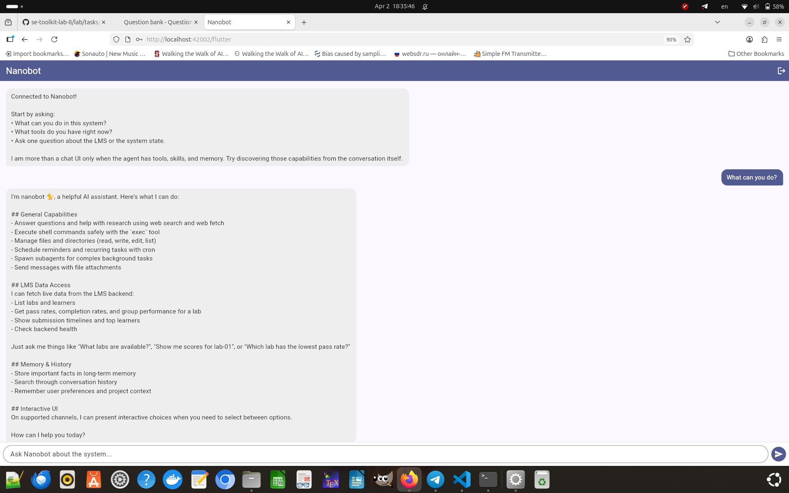
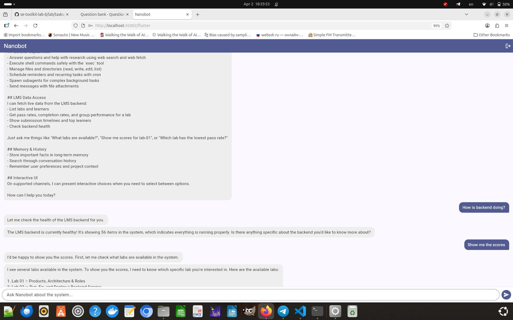
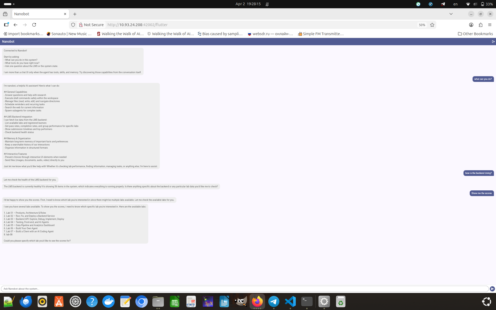
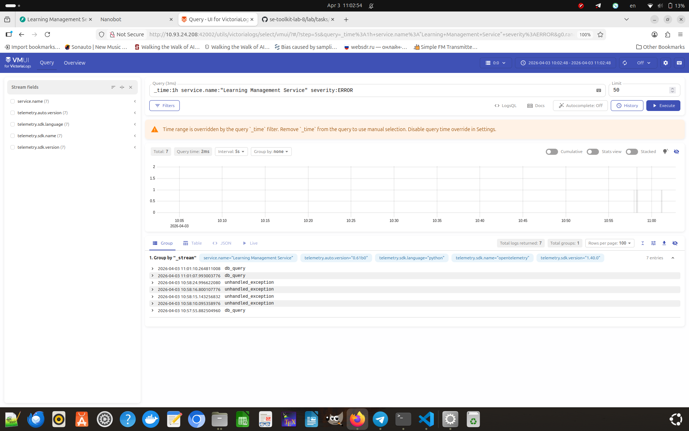
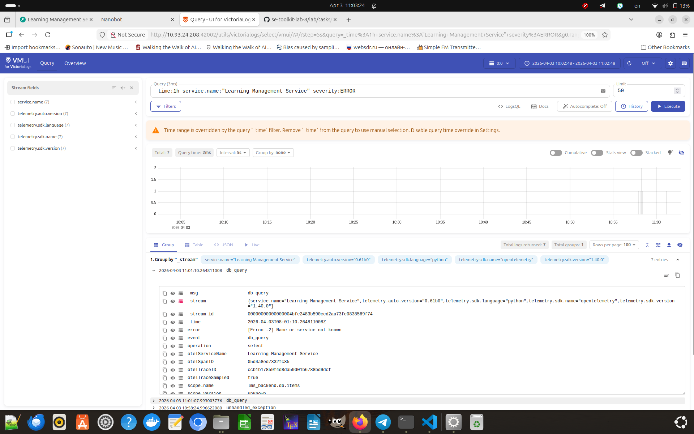
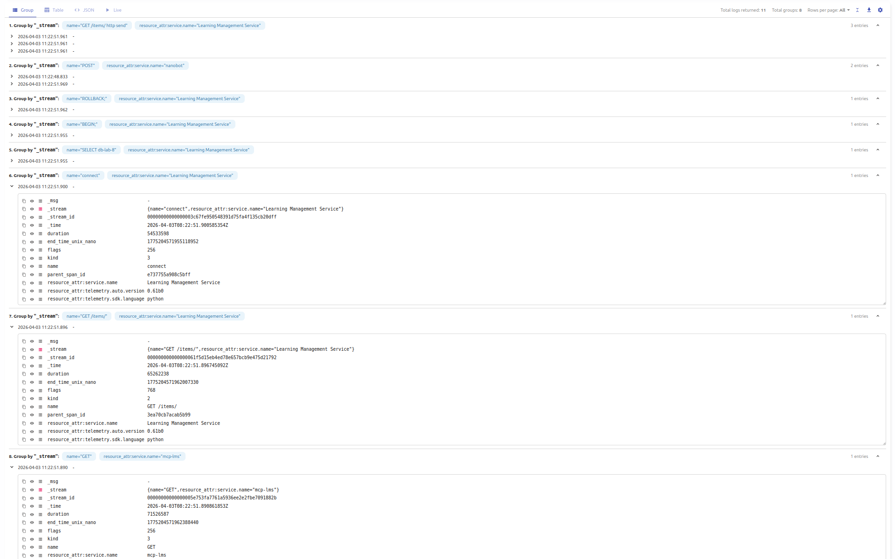
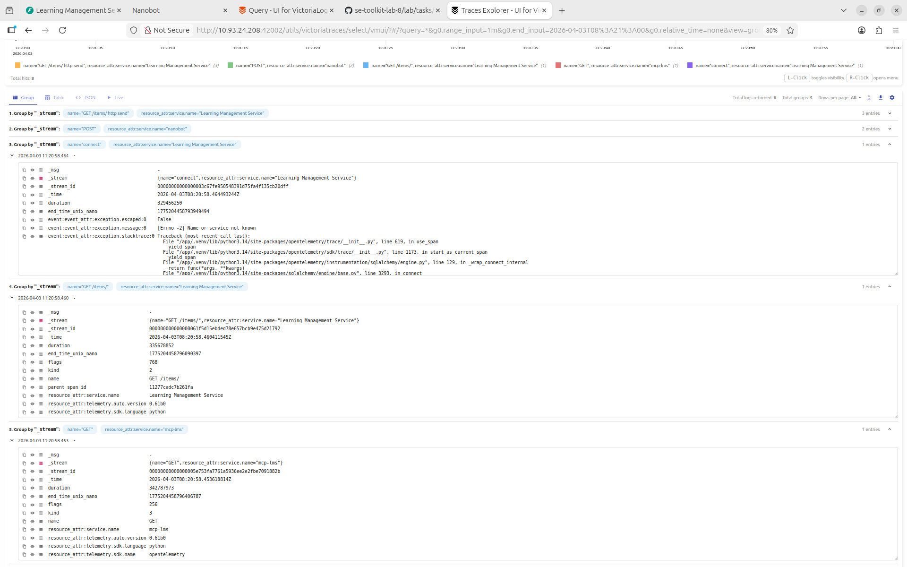

# Lab 8 — Report

## Task 1A — Bare agent

<!--### Q1: "What is 2+2?"-->

2 + 2 = 4

<!--### Q2: "What is the agentic loop?"-->

The agentic loop is the fundamental cycle that an AI agent follows to accomplish tasks autonomously. It typically consists of these core stages:

**The Agentic Loop Cycle:**

1. **Perceive** — Gather information from the environment
   - Read user input
   - Observe current state (files, system, context)
   - Retrieve relevant memories or knowledge

2. **Reason** — Process and plan
   - Analyze the situation
   - Determine goals and constraints
   - Decide on next actions or create a plan

3. **Act** — Execute decisions
   - Call tools (file operations, web search, commands, etc.)
   - Modify the environment
   - Communicate results

4. **Reflect** — Evaluate outcomes
   - Check if the goal was achieved
   - Learn from errors or unexpected results
   - Adjust strategy if needed

Then the loop repeats until the task is complete.

**Why It Matters:**

This loop enables autonomous behavior — the agent doesn't just respond once, but iteratively works toward a goal, adapting based on feedback from each action. More sophisticated agents may also include:

- Memory updates — Storing learned information
- Multi-step planning — Breaking complex tasks into subtasks
- Self-correction — Detecting and fixing mistakes

In my case, every time you give me a task, I go through this loop: I read the request, decide what tools to use, execute them, and then respond or continue iterating based on the results.

<!--### Q3: "What labs are available in our LMS?"-->

The agent **does not have access to the live LMS backend** yet. It explored the local filesystem using built-in tools (`list_dir`, `read_file`) and found lab task descriptions in the repository:

Based on my exploration of the workspace, here are the available labs in your LMS:

**Required Labs:**
1. Task 1 — Set Up the Agent (install nanobot, configure Qwen API, add MCP tools, write skill prompt)
2. Task 2 — Deploy and Connect a Web Client (Dockerize nanobot, add WebSocket channel + Flutter chat UI)
3. Task 3 — Give the Agent New Eyes (explore observability data, write log/trace MCP tools)
4. Task 4 — Diagnose a Failure and Make the Agent Proactive (investigate a failure, schedule in-chat health checks, fix a planted bug)

**Optional Labs:**
1. Task 1 — Add a Telegram Bot Client (same agent, different interface)

This is Lab 8 — "The Agent is the Interface" from the Software Engineering Toolkit course. The lab focuses on building an AI agent (nanobot) as a      
natural-language interface to an LMS system, with capabilities for querying data, observability tools, and proactive health checks.                    

Would you like me to read the details of any specific task?                                                      

## Task 1B — Agent with LMS tools

<!--### Q1: "What is the agentic loop?"-->

The agentic loop refers to the iterative process that autonomous AI agents follow to accomplish tasks. While the specific implementation can vary between different AI systems, a typical     
agentic loop includes these core phases:                                                                                                                                                      

 1 Perception/Observation: The agent gathers information from its environment, user requests, or available data sources.                                                                      
 2 Reasoning/Planning: The agent analyzes the gathered information, determines what needs to be done, and formulates a plan of action.                                                        
 3 Action: The agent executes specific tools, commands, or operations to move toward its goal.                                                                                                
 4 Observation/Evaluation: The agent observes the results of its actions and evaluates progress toward the goal.                                                                              
 5 Iteration: The agent returns to planning based on new observations, adjusting its approach as needed until the task is completed.                                                          

This cycle continues until the agent achieves its objective or determines that it cannot proceed further. The loop allows AI agents to handle complex, multi-step tasks by breaking them down 
into smaller, manageable actions while adapting to new information or unexpected outcomes during execution.                                                                                   

In my case as nanobot, I follow this pattern by receiving your requests, analyzing them, using appropriate tools to gather information or perform actions, observing the results, and then    
determining the next steps in our conversation.    

<!--### Q2: "Is the LMS backend healthy?">

Let me check the health of the LMS backend:                                                                                                                

Yes, the LMS backend is healthy. The system is operational with 56 items and no errors reported.

<!--### Q3: "What labs are available?"-->

I'll check what labs are available in the LMS system for you.                                                                                          

Here are the available labs in the LMS system:                                                                                                         

 1 Lab 01 – Products, Architecture & Roles                                                                                                             
 2 Lab 02 — Run, Fix, and Deploy a Backend Service                                                                                                     
 3 Lab 03 — Backend API: Explore, Debug, Implement, Deploy                                                                                             
 4 Lab 04 — Testing, Front-end, and AI Agents                                                                                                          
 5 Lab 05 — Data Pipeline and Analytics Dashboard                                                                                                      
 6 Lab 06 — Build Your Own Agent                                                                                                                       
 7 Lab 07 — Build a Client with an AI Coding Agent                                                                                                     
 8 Lab 08                                                                                                                   

## Task 1C — Skill prompt

<!--### Q1: "Show me the scores"-->

I'll help you check the scores. First, let me see what labs are available in the system.

I can see there are 8 labs available in the system. To show you the scores, I need to know which specific lab you're interested in. Here are the       
available labs:                                                                                                                                        

 1 Lab 01 – Products, Architecture & Roles                                                                                                             
 2 Lab 02 — Run, Fix, and Deploy a Backend Service                                                                                                     
 3 Lab 03 — Backend API: Explore, Debug, Implement, Deploy                                                                                             
 4 Lab 04 — Testing, Front-end, and AI Agents                                                                                                          
 5 Lab 05 — Data Pipeline and Analytics Dashboard                                                                                                      
 6 Lab 06 — Build Your Own Agent                                                                                                                       
 7 Lab 07 — Build a Client with an AI Coding Agent                                                                                                     
 8 lab-08                                                                                                                                              

Could you please specify which lab you'd like to see the scores for?                                                        

## Task 2A — Deployed agent

nanobot-1  | Using config: /app/nanobot/config.resolved.json
nanobot-1  | 🐈 Starting nanobot gateway version 0.1.4.post5 on port 18790...
nanobot-1  | 2026-04-02 15:12:02.818 | DEBUG    | nanobot.channels.registry:discover_all:64 - Skipping built-in channel 'matrix': Matrix dependencies not installed. Run: pip install nanobot-ai[matrix]
nanobot-1  | Warning: No channels enabled
nanobot-1  | ✓ Heartbeat: every 1800s
nanobot-1  | 2026-04-02 15:12:02.993 | INFO     | nanobot.cron.service:start:202 - Cron service started with 0 jobs
nanobot-1  | 2026-04-02 15:12:02.993 | INFO     | nanobot.heartbeat.service:start:124 - Heartbeat started (every 1800s)
nanobot-1  | 2026-04-02 15:12:03.147 | WARNING  | nanobot.channels.manager:start_all:82 - No channels enabled
nanobot-1  | 2026-04-02 15:12:04,300 INFO [mcp.server.lowlevel.server] [server.py:727] [trace_id=0 span_id=0 resource.service.name=mcp-lms trace_sampled=False] - Processing request of type ListToolsRequest
nanobot-1  | 2026-04-02 15:12:04.304 | DEBUG    | nanobot.agent.tools.mcp:connect_mcp_servers:226 - MCP: registered tool 'mcp_lms_lms_health' from server 'lms'
nanobot-1  | 2026-04-02 15:12:04.304 | DEBUG    | nanobot.agent.tools.mcp:connect_mcp_servers:226 - MCP: registered tool 'mcp_lms_lms_labs' from server 'lms'
nanobot-1  | 2026-04-02 15:12:04.304 | DEBUG    | nanobot.agent.tools.mcp:connect_mcp_servers:226 - MCP: registered tool 'mcp_lms_lms_learners' from server 'lms'
nanobot-1  | 2026-04-02 15:12:04.304 | DEBUG    | nanobot.agent.tools.mcp:connect_mcp_servers:226 - MCP: registered tool 'mcp_lms_lms_pass_rates' from server 'lms'
nanobot-1  | 2026-04-02 15:12:04.304 | DEBUG    | nanobot.agent.tools.mcp:connect_mcp_servers:226 - MCP: registered tool 'mcp_lms_lms_timeline' from server 'lms'
nanobot-1  | 2026-04-02 15:12:04.304 | DEBUG    | nanobot.agent.tools.mcp:connect_mcp_servers:226 - MCP: registered tool 'mcp_lms_lms_groups' from server 'lms'
nanobot-1  | 2026-04-02 15:12:04.304 | DEBUG    | nanobot.agent.tools.mcp:connect_mcp_servers:226 - MCP: registered tool 'mcp_lms_lms_top_learners' from server 'lms'
nanobot-1  | 2026-04-02 15:12:04.304 | DEBUG    | nanobot.agent.tools.mcp:connect_mcp_servers:226 - MCP: registered tool 'mcp_lms_lms_completion_rate' from server 'lms'
nanobot-1  | 2026-04-02 15:12:04.304 | DEBUG    | nanobot.agent.tools.mcp:connect_mcp_servers:226 - MCP: registered tool 'mcp_lms_lms_sync_pipeline' from server 'lms'
nanobot-1  | 2026-04-02 15:12:04.304 | INFO     | nanobot.agent.tools.mcp:connect_mcp_servers:246 - MCP server 'lms': connected, 9 tools registered
nanobot-1  | 2026-04-02 15:12:04.304 | INFO     | nanobot.agent.loop:run:280 - Agent loop started

## Task 2B — Web client

<!---### Q1: what can you do?--->

I'm nanobot, a helpful AI assistant! Here's what I can do:

General Capabilities

- Answer questions and help with research
- Execute shell commands safely within the workspace
- Manage files (read, write, edit) and navigate directories
- Schedule reminders and recurring tasks
- Search the web for current information
- Spawn subagents for complex tasks

LMS Backend Integration

I can fetch live data from the LMS backend:
- List available labs and registered learners
- Get pass rates, completion rates, and group performance for specific labs
- Show submission timelines and top performers
- Check backend health status

Memory & Organization

- Maintain long-term memory of important facts and preferences
- Keep a searchable history of our interactions
- Organize information in structured formats

Interactive Features

- Present choices through interactive UI elements when needed
- Send files (images, documents, audio, video) directly to you

Just let me know what you'd like help with! Whether it's checking lab performance, finding information, managing tasks, or anything else, I'm here to assist.

<!---### Q2: show me the scores--->

I see you have several labs available. To show you the scores, I need to know which specific lab you're interested in. Here are the available labs:

1. Lab 01 – Products, Architecture & Roles
2. Lab 02 — Run, Fix, and Deploy a Backend Service
3. Lab 03 — Backend API: Explore, Debug, Implement, Deploy
4. Lab 04 — Testing, Front-end, and AI Agents
5. Lab 05 — Data Pipeline and Analytics Dashboard
6. Lab 06 — Build Your Own Agent
7. Lab 07 — Build a Client with an AI Coding Agent
8. lab-08

Could you please specify which lab you'd like to see the scores for?

## Task 3A — Structured logging

backend-1  | INFO:     Started server process [1]
backend-1  | INFO:     Waiting for application startup.
backend-1  | INFO:     Application startup complete.
backend-1  | INFO:     Uvicorn running on http://0.0.0.0:8000 (Press CTRL+C to quit)
backend-1  | 2026-04-02 18:15:24,227 INFO [lms_backend.main] [main.py:62] [trace_id=745338e40eaa2e060d17f8454dba575f span_id=e67fbeb3a2f59adc resource.service.name=Learning Management Service trace_sampled=True] - request_started
backend-1  | 2026-04-02 18:15:24,229 WARNING [lms_backend.auth] [auth.py:25] [trace_id=745338e40eaa2e060d17f8454dba575f span_id=e67fbeb3a2f59adc resource.service.name=Learning Management Service trace_sampled=True] - auth_failure
backend-1  | 2026-04-02 18:15:24,229 INFO [lms_backend.main] [main.py:74] [trace_id=745338e40eaa2e060d17f8454dba575f span_id=e67fbeb3a2f59adc resource.service.name=Learning Management Service trace_sampled=True] - request_completed
backend-1  | INFO:     172.18.0.10:59050 - "GET /items/ HTTP/1.1" 401
backend-1  | INFO:     172.18.0.10:59050 - "GET /items/ HTTP/1.1" 401 Unauthorized
backend-1  | 2026-04-02 18:15:33,104 INFO [lms_backend.main] [main.py:62] [trace_id=613ddd566a6d22f00b4dd111f7fa8ac3 span_id=42e1a45c54f69f12 resource.service.name=Learning Management Service trace_sampled=True] - request_started
backend-1  | 2026-04-02 18:15:33,106 INFO [lms_backend.auth] [auth.py:30] [trace_id=613ddd566a6d22f00b4dd111f7fa8ac3 span_id=42e1a45c54f69f12 resource.service.name=Learning Management Service trace_sampled=True] - auth_success
backend-1  | 2026-04-02 18:15:33,107 INFO [lms_backend.db.items] [items.py:16] [trace_id=613ddd566a6d22f00b4dd111f7fa8ac3 span_id=42e1a45c54f69f12 resource.service.name=Learning Management Service trace_sampled=True] - db_query
backend-1  | 2026-04-02 18:15:33,181 INFO [lms_backend.main] [main.py:74] [trace_id=613ddd566a6d22f00b4dd111f7fa8ac3 span_id=42e1a45c54f69f12 resource.service.name=Learning Management Service trace_sampled=True] - request_completed
backend-1  | INFO:     172.18.0.10:52268 - "GET /items/ HTTP/1.1" 200
backend-1  | INFO:     172.18.0.10:52268 - "GET /items/ HTTP/1.1" 200 OK
backend-1  | 2026-04-02 18:15:37,891 INFO [lms_backend.main] [main.py:62] [trace_id=29d001cad3d28b4bbe41b021c2e055c4 span_id=e8c4b4a5e4cc8079 resource.service.name=Learning Management Service trace_sampled=True] - request_started
backend-1  | 2026-04-02 18:15:37,893 INFO [lms_backend.auth] [auth.py:30] [trace_id=29d001cad3d28b4bbe41b021c2e055c4 span_id=e8c4b4a5e4cc8079 resource.service.name=Learning Management Service trace_sampled=True] - auth_success
backend-1  | 2026-04-02 18:15:37,894 INFO [lms_backend.db.items] [items.py:16] [trace_id=29d001cad3d28b4bbe41b021c2e055c4 span_id=e8c4b4a5e4cc8079 resource.service.name=Learning Management Service trace_sampled=True] - db_query
backend-1  | 2026-04-02 18:15:37,904 INFO [lms_backend.main] [main.py:74] [trace_id=29d001cad3d28b4bbe41b021c2e055c4 span_id=e8c4b4a5e4cc8079 resource.service.name=Learning Management Service trace_sampled=True] - request_completed
backend-1  | INFO:     172.18.0.10:52268 - "GET /items/ HTTP/1.1" 200 OK
backend-1  | INFO:     172.18.0.10:52268 - "GET /items/ HTTP/1.1" 200
backend-1  | 2026-04-02 18:15:37,942 INFO [lms_backend.main] [main.py:62] [trace_id=976fb92b690b2ccd2e5215f279795b2f span_id=c634eba8633c109b resource.service.name=Learning Management Service trace_sampled=True] - request_started
backend-1  | 2026-04-02 18:15:37,947 INFO [lms_backend.main] [main.py:62] [trace_id=7a0cb2b9eb64d70b85bf8607cc8efeb8 span_id=56176999af336c82 resource.service.name=Learning Management Service trace_sampled=True] - request_started
backend-1  | 2026-04-02 18:15:37,948 INFO [lms_backend.auth] [auth.py:30] [trace_id=976fb92b690b2ccd2e5215f279795b2f span_id=c634eba8633c109b resource.service.name=Learning Management Service trace_sampled=True] - auth_success
backend-1  | 2026-04-02 18:15:37,951 INFO [lms_backend.main] [main.py:62] [trace_id=b52219850a09bf15cbe795845f160b88 span_id=35a838cf86dc6cc5 resource.service.name=Learning Management Service trace_sampled=True] - request_started
backend-1  | 2026-04-02 18:15:37,954 INFO [lms_backend.main] [main.py:62] [trace_id=09bf0456f097c5e7eb51065e8dda14b2 span_id=7da8f582b02a3715 resource.service.name=Learning Management Service trace_sampled=True] - request_started
backend-1  | 2026-04-02 18:15:37,959 INFO [lms_backend.auth] [auth.py:30] [trace_id=7a0cb2b9eb64d70b85bf8607cc8efeb8 span_id=56176999af336c82 resource.service.name=Learning Management Service trace_sampled=True] - auth_success
backend-1  | 2026-04-02 18:15:37,961 INFO [lms_backend.auth] [auth.py:30] [trace_id=b52219850a09bf15cbe795845f160b88 span_id=35a838cf86dc6cc5 resource.service.name=Learning Management Service trace_sampled=True] - auth_success
backend-1  | 2026-04-02 18:15:37,967 INFO [lms_backend.auth] [auth.py:30] [trace_id=09bf0456f097c5e7eb51065e8dda14b2 span_id=7da8f582b02a3715 resource.service.name=Learning Management Service trace_sampled=True] - auth_success
backend-1  | 2026-04-02 18:15:38,074 INFO [lms_backend.main] [main.py:74] [trace_id=976fb92b690b2ccd2e5215f279795b2f span_id=c634eba8633c109b resource.service.name=Learning Management Service trace_sampled=True] - request_completed
backend-1  | INFO:     172.18.0.10:52274 - "GET /analytics/scores?lab=lab-07 HTTP/1.1" 200
backend-1  | INFO:     172.18.0.10:52274 - "GET /analytics/scores?lab=lab-07 HTTP/1.1" 200 OK
backend-1  | 2026-04-02 18:15:38,097 INFO [lms_backend.main] [main.py:74] [trace_id=09bf0456f097c5e7eb51065e8dda14b2 span_id=7da8f582b02a3715 resource.service.name=Learning Management Service trace_sampled=True] - request_completed
backend-1  | INFO:     172.18.0.10:52298 - "GET /analytics/timeline?lab=lab-07 HTTP/1.1" 200 OK
backend-1  | INFO:     172.18.0.10:52298 - "GET /analytics/timeline?lab=lab-07 HTTP/1.1" 200
backend-1  | 2026-04-02 18:15:38,106 INFO [lms_backend.main] [main.py:74] [trace_id=b52219850a09bf15cbe795845f160b88 span_id=35a838cf86dc6cc5 resource.service.name=Learning Management Service trace_sampled=True] - request_completed
backend-1  | INFO:     172.18.0.10:52288 - "GET /analytics/groups?lab=lab-07 HTTP/1.1" 200 OK
backend-1  | INFO:     172.18.0.10:52288 - "GET /analytics/groups?lab=lab-07 HTTP/1.1" 200
backend-1  | 2026-04-02 18:15:38,112 INFO [lms_backend.main] [main.py:74] [trace_id=7a0cb2b9eb64d70b85bf8607cc8efeb8 span_id=56176999af336c82 resource.service.name=Learning Management Service trace_sampled=True] - request_completed
backend-1  | INFO:     172.18.0.10:52276 - "GET /analytics/pass-rates?lab=lab-07 HTTP/1.1" 200
backend-1  | INFO:     172.18.0.10:52276 - "GET /analytics/pass-rates?lab=lab-07 HTTP/1.1" 200 OK
backend-1  | 2026-04-02 18:15:39,562 INFO [lms_backend.main] [main.py:62] [trace_id=15dd632d67ddad9cb8a7d016efc129bb span_id=f363129d7cf34174 resource.service.name=Learning Management Service trace_sampled=True] - request_started
backend-1  | 2026-04-02 18:15:39,564 INFO [lms_backend.main] [main.py:62] [trace_id=a7c6db4c73277577296d2d6eae59f1fa span_id=ba5db56bf0351870 resource.service.name=Learning Management Service trace_sampled=True] - request_started
backend-1  | 2026-04-02 18:15:39,566 INFO [lms_backend.main] [main.py:62] [trace_id=417aaef9c9f0b78831681f75355e2055 span_id=1e0e6d971cf2b193 resource.service.name=Learning Management Service trace_sampled=True] - request_started
backend-1  | 2026-04-02 18:15:39,570 INFO [lms_backend.main] [main.py:62] [trace_id=b357fe83dfd2b86a76f1f25e85659353 span_id=c698c0e3b626ae0b resource.service.name=Learning Management Service trace_sampled=True] - request_started
backend-1  | 2026-04-02 18:15:39,572 INFO [lms_backend.auth] [auth.py:30] [trace_id=a7c6db4c73277577296d2d6eae59f1fa span_id=ba5db56bf0351870 resource.service.name=Learning Management Service trace_sampled=True] - auth_success
backend-1  | 2026-04-02 18:15:39,573 INFO [lms_backend.auth] [auth.py:30] [trace_id=15dd632d67ddad9cb8a7d016efc129bb span_id=f363129d7cf34174 resource.service.name=Learning Management Service trace_sampled=True] - auth_success
backend-1  | 2026-04-02 18:15:39,574 INFO [lms_backend.auth] [auth.py:30] [trace_id=417aaef9c9f0b78831681f75355e2055 span_id=1e0e6d971cf2b193 resource.service.name=Learning Management Service trace_sampled=True] - auth_success
backend-1  | 2026-04-02 18:15:39,575 INFO [lms_backend.auth] [auth.py:30] [trace_id=b357fe83dfd2b86a76f1f25e85659353 span_id=c698c0e3b626ae0b resource.service.name=Learning Management Service trace_sampled=True] - auth_success
backend-1  | 2026-04-02 18:15:39,613 INFO [lms_backend.main] [main.py:74] [trace_id=417aaef9c9f0b78831681f75355e2055 span_id=1e0e6d971cf2b193 resource.service.name=Learning Management Service trace_sampled=True] - request_completed
backend-1  | INFO:     172.18.0.10:52298 - "GET /analytics/timeline?lab=lab-02 HTTP/1.1" 200
backend-1  | INFO:     172.18.0.10:52298 - "GET /analytics/timeline?lab=lab-02 HTTP/1.1" 200 OK
backend-1  | 2026-04-02 18:15:39,614 INFO [lms_backend.main] [main.py:74] [trace_id=a7c6db4c73277577296d2d6eae59f1fa span_id=ba5db56bf0351870 resource.service.name=Learning Management Service trace_sampled=True] - request_completed
backend-1  | INFO:     172.18.0.10:52288 - "GET /analytics/scores?lab=lab-02 HTTP/1.1" 200 OK
backend-1  | INFO:     172.18.0.10:52288 - "GET /analytics/scores?lab=lab-02 HTTP/1.1" 200
backend-1  | 2026-04-02 18:15:39,616 INFO [lms_backend.main] [main.py:74] [trace_id=15dd632d67ddad9cb8a7d016efc129bb span_id=f363129d7cf34174 resource.service.name=Learning Management Service trace_sampled=True] - request_completed
backend-1  | INFO:     172.18.0.10:52276 - "GET /analytics/groups?lab=lab-02 HTTP/1.1" 200 OK
backend-1  | INFO:     172.18.0.10:52276 - "GET /analytics/groups?lab=lab-02 HTTP/1.1" 200
backend-1  | 2026-04-02 18:15:39,626 INFO [lms_backend.main] [main.py:74] [trace_id=b357fe83dfd2b86a76f1f25e85659353 span_id=c698c0e3b626ae0b resource.service.name=Learning Management Service trace_sampled=True] - request_completed
backend-1  | INFO:     172.18.0.10:52274 - "GET /analytics/pass-rates?lab=lab-02 HTTP/1.1" 200 OK
backend-1  | INFO:     172.18.0.10:52274 - "GET /analytics/pass-rates?lab=lab-02 HTTP/1.1" 200
backend-1  | 2026-04-02 18:16:00,633 INFO [lms_backend.main] [main.py:62] [trace_id=0e866dcd74bf12c5fa31cadf12a4ea51 span_id=1fc01c75ddfbc87f resource.service.name=Learning Management Service trace_sampled=True] - request_started
backend-1  | 2026-04-02 18:16:00,635 INFO [lms_backend.auth] [auth.py:30] [trace_id=0e866dcd74bf12c5fa31cadf12a4ea51 span_id=1fc01c75ddfbc87f resource.service.name=Learning Management Service trace_sampled=True] - auth_success
backend-1  | 2026-04-02 18:16:00,636 INFO [lms_backend.db.items] [items.py:16] [trace_id=0e866dcd74bf12c5fa31cadf12a4ea51 span_id=1fc01c75ddfbc87f resource.service.name=Learning Management Service trace_sampled=True] - db_query
backend-1  | 2026-04-02 18:16:00,646 INFO [lms_backend.main] [main.py:74] [trace_id=0e866dcd74bf12c5fa31cadf12a4ea51 span_id=1fc01c75ddfbc87f resource.service.name=Learning Management Service trace_sampled=True] - request_completed
backend-1  | INFO:     172.18.0.10:52992 - "GET /items/ HTTP/1.1" 200
backend-1  | INFO:     172.18.0.10:52992 - "GET /items/ HTTP/1.1" 200 OK
backend-1  | 2026-04-02 18:26:07,011 INFO [lms_backend.main] [main.py:62] [trace_id=41f42a510e189c9f4b6dc9c865515fdc span_id=5c2bd918229db56b resource.service.name=Learning Management Service trace_sampled=True] - request_started
backend-1  | 2026-04-02 18:26:07,012 INFO [lms_backend.auth] [auth.py:30] [trace_id=41f42a510e189c9f4b6dc9c865515fdc span_id=5c2bd918229db56b resource.service.name=Learning Management Service trace_sampled=True] - auth_success
backend-1  | 2026-04-02 18:26:07,013 INFO [lms_backend.db.items] [items.py:16] [trace_id=41f42a510e189c9f4b6dc9c865515fdc span_id=5c2bd918229db56b resource.service.name=Learning Management Service trace_sampled=True] - db_query
backend-1  | 2026-04-02 18:26:07,021 INFO [lms_backend.main] [main.py:74] [trace_id=41f42a510e189c9f4b6dc9c865515fdc span_id=5c2bd918229db56b resource.service.name=Learning Management Service trace_sampled=True] - request_completed
backend-1  | INFO:     172.18.0.10:37028 - "GET /items/ HTTP/1.1" 200
backend-1  | INFO:     172.18.0.10:37028 - "GET /items/ HTTP/1.1" 200 OK
backend-1  | 2026-04-02 18:28:45,120 INFO [lms_backend.main] [main.py:62] [trace_id=8a07fa8278736941634bba696a91d51f span_id=5e487ec20215ad14 resource.service.name=Learning Management Service trace_sampled=True] - request_started
backend-1  | 2026-04-02 18:28:45,122 INFO [lms_backend.auth] [auth.py:30] [trace_id=8a07fa8278736941634bba696a91d51f span_id=5e487ec20215ad14 resource.service.name=Learning Management Service trace_sampled=True] - auth_success
backend-1  | 2026-04-02 18:28:45,124 INFO [lms_backend.db.items] [items.py:16] [trace_id=8a07fa8278736941634bba696a91d51f span_id=5e487ec20215ad14 resource.service.name=Learning Management Service trace_sampled=True] - db_query
backend-1  | 2026-04-02 18:28:45,134 INFO [lms_backend.main] [main.py:74] [trace_id=8a07fa8278736941634bba696a91d51f span_id=5e487ec20215ad14 resource.service.name=Learning Management Service trace_sampled=True] - request_completed
backend-1  | INFO:     172.18.0.10:38904 - "GET /items/ HTTP/1.1" 200
backend-1  | INFO:     172.18.0.10:38904 - "GET /items/ HTTP/1.1" 200 OK
backend-1  | 2026-04-02 18:35:36,376 INFO [lms_backend.main] [main.py:62] [trace_id=600d758e71134a95d820bc1c2e231311 span_id=6ada18895b6a44e4 resource.service.name=Learning Management Service trace_sampled=True] - request_started
backend-1  | 2026-04-02 18:35:36,376 INFO [lms_backend.auth] [auth.py:30] [trace_id=600d758e71134a95d820bc1c2e231311 span_id=6ada18895b6a44e4 resource.service.name=Learning Management Service trace_sampled=True] - auth_success
backend-1  | 2026-04-02 18:35:36,377 INFO [lms_backend.db.items] [items.py:16] [trace_id=600d758e71134a95d820bc1c2e231311 span_id=6ada18895b6a44e4 resource.service.name=Learning Management Service trace_sampled=True] - db_query
backend-1  | 2026-04-02 18:35:36,382 INFO [lms_backend.main] [main.py:74] [trace_id=600d758e71134a95d820bc1c2e231311 span_id=6ada18895b6a44e4 resource.service.name=Learning Management Service trace_sampled=True] - request_completed
backend-1  | INFO:     172.18.0.9:59748 - "GET /items/ HTTP/1.1" 200 OK
backend-1  | INFO:     172.18.0.9:59748 - "GET /items/ HTTP/1.1" 200
backend-1  | 2026-04-02 18:37:44,243 INFO [lms_backend.main] [main.py:62] [trace_id=3b97bb98d5b74ad3977c8d143c987de9 span_id=27afaec372c771ef resource.service.name=Learning Management Service trace_sampled=True] - request_started
backend-1  | 2026-04-02 18:37:44,244 INFO [lms_backend.auth] [auth.py:30] [trace_id=3b97bb98d5b74ad3977c8d143c987de9 span_id=27afaec372c771ef resource.service.name=Learning Management Service trace_sampled=True] - auth_success
backend-1  | 2026-04-02 18:37:44,290 ERROR [lms_backend.main] [main.py:43] [trace_id=3b97bb98d5b74ad3977c8d143c987de9 span_id=27afaec372c771ef resource.service.name=Learning Management Service trace_sampled=True] - unhandled_exception
backend-1  | Traceback (most recent call last):
backend-1  |   File "/app/.venv/lib/python3.14/site-packages/sqlalchemy/dialects/postgresql/asyncpg.py", line 843, in _start_transaction
backend-1  |     self._transaction = self._connection.transaction(
backend-1  |                         ~~~~~~~~~~~~~~~~~~~~~~~~~~~~^
backend-1  |         isolation=self.isolation_level,
backend-1  |         ^^^^^^^^^^^^^^^^^^^^^^^^^^^^^^^
backend-1  |         readonly=self.readonly,
backend-1  |         ^^^^^^^^^^^^^^^^^^^^^^^
backend-1  |         deferrable=self.deferrable,
backend-1  |         ^^^^^^^^^^^^^^^^^^^^^^^^^^^
backend-1  |     )
backend-1  |     ^
backend-1  |   File "/app/.venv/lib/python3.14/site-packages/asyncpg/connection.py", line 302, in transaction
backend-1  |     self._check_open()
backend-1  |     ~~~~~~~~~~~~~~~~^^
backend-1  |   File "/app/.venv/lib/python3.14/site-packages/asyncpg/connection.py", line 1605, in _check_open
backend-1  |     raise exceptions.InterfaceError('connection is closed')
backend-1  | asyncpg.exceptions._base.InterfaceError: connection is closed
backend-1  | 
backend-1  | The above exception was the direct cause of the following exception:
backend-1  | 
backend-1  | Traceback (most recent call last):
backend-1  |   File "/app/.venv/lib/python3.14/site-packages/sqlalchemy/engine/base.py", line 1967, in _exec_single_context
backend-1  |     self.dialect.do_execute(
backend-1  |     ~~~~~~~~~~~~~~~~~~~~~~~^
backend-1  |         cursor, str_statement, effective_parameters, context
backend-1  |         ^^^^^^^^^^^^^^^^^^^^^^^^^^^^^^^^^^^^^^^^^^^^^^^^^^^^
backend-1  |     )
backend-1  |     ^
backend-1  |   File "/app/.venv/lib/python3.14/site-packages/sqlalchemy/engine/default.py", line 952, in do_execute
backend-1  |     cursor.execute(statement, parameters)
backend-1  |     ~~~~~~~~~~~~~~^^^^^^^^^^^^^^^^^^^^^^^
backend-1  |   File "/app/.venv/lib/python3.14/site-packages/sqlalchemy/dialects/postgresql/asyncpg.py", line 585, in execute
backend-1  |     self._adapt_connection.await_(
backend-1  |     ~~~~~~~~~~~~~~~~~~~~~~~~~~~~~^
backend-1  |         self._prepare_and_execute(operation, parameters)
backend-1  |         ^^^^^^^^^^^^^^^^^^^^^^^^^^^^^^^^^^^^^^^^^^^^^^^^
backend-1  |     )
backend-1  |     ^
backend-1  |   File "/app/.venv/lib/python3.14/site-packages/sqlalchemy/util/_concurrency_py3k.py", line 132, in await_only
backend-1  |     return current.parent.switch(awaitable)  # type: ignore[no-any-return,attr-defined] # noqa: E501
backend-1  |            ~~~~~~~~~~~~~~~~~~~~~^^^^^^^^^^^
backend-1  |   File "/app/.venv/lib/python3.14/site-packages/sqlalchemy/util/_concurrency_py3k.py", line 196, in greenlet_spawn
backend-1  |     value = await result
backend-1  |             ^^^^^^^^^^^^
backend-1  |   File "/app/.venv/lib/python3.14/site-packages/sqlalchemy/dialects/postgresql/asyncpg.py", line 520, in _prepare_and_execute
backend-1  |     await adapt_connection._start_transaction()
backend-1  |   File "/app/.venv/lib/python3.14/site-packages/sqlalchemy/dialects/postgresql/asyncpg.py", line 850, in _start_transaction
backend-1  |     self._handle_exception(error)
backend-1  |     ~~~~~~~~~~~~~~~~~~~~~~^^^^^^^
backend-1  |   File "/app/.venv/lib/python3.14/site-packages/sqlalchemy/dialects/postgresql/asyncpg.py", line 797, in _handle_exception
backend-1  |     raise translated_error from error
backend-1  | sqlalchemy.dialects.postgresql.asyncpg.AsyncAdapt_asyncpg_dbapi.InterfaceError: <class 'asyncpg.exceptions._base.InterfaceError'>: connection is closed
backend-1  | 
backend-1  | The above exception was the direct cause of the following exception:
backend-1  | 
backend-1  | Traceback (most recent call last):
backend-1  |   File "/app/.venv/lib/python3.14/site-packages/starlette/middleware/errors.py", line 164, in __call__
backend-1  |     await self.app(scope, receive, _send)
backend-1  |   File "/app/.venv/lib/python3.14/site-packages/opentelemetry/instrumentation/fastapi/__init__.py", line 307, in __call__
backend-1  |     await self.app(scope, receive, send)
backend-1  |   File "/app/.venv/lib/python3.14/site-packages/starlette/middleware/cors.py", line 87, in __call__
backend-1  |     await self.app(scope, receive, send)
backend-1  |   File "/app/.venv/lib/python3.14/site-packages/starlette/middleware/base.py", line 191, in __call__
backend-1  |     with recv_stream, send_stream, collapse_excgroups():
backend-1  |                                    ~~~~~~~~~~~~~~~~~~^^
backend-1  |   File "/usr/local/lib/python3.14/contextlib.py", line 162, in __exit__
backend-1  |     self.gen.throw(value)
backend-1  |     ~~~~~~~~~~~~~~^^^^^^^
backend-1  |   File "/app/.venv/lib/python3.14/site-packages/starlette/_utils.py", line 87, in collapse_excgroups
backend-1  |     raise exc
backend-1  |   File "/app/.venv/lib/python3.14/site-packages/starlette/middleware/base.py", line 193, in __call__
backend-1  |     response = await self.dispatch_func(request, call_next)
backend-1  |                ^^^^^^^^^^^^^^^^^^^^^^^^^^^^^^^^^^^^^^^^^^^^
backend-1  |   File "/app/backend/src/lms_backend/main.py", line 71, in log_requests
backend-1  |     response = await call_next(request)
backend-1  |                ^^^^^^^^^^^^^^^^^^^^^^^^
backend-1  |   File "/app/.venv/lib/python3.14/site-packages/starlette/middleware/base.py", line 168, in call_next
backend-1  |     raise app_exc from app_exc.__cause__ or app_exc.__context__
backend-1  |   File "/app/.venv/lib/python3.14/site-packages/starlette/middleware/base.py", line 144, in coro
backend-1  |     await self.app(scope, receive_or_disconnect, send_no_error)
backend-1  |   File "/app/.venv/lib/python3.14/site-packages/starlette/middleware/exceptions.py", line 63, in __call__
backend-1  |     await wrap_app_handling_exceptions(self.app, conn)(scope, receive, send)
backend-1  |   File "/app/.venv/lib/python3.14/site-packages/starlette/_exception_handler.py", line 53, in wrapped_app
backend-1  |     raise exc
backend-1  |   File "/app/.venv/lib/python3.14/site-packages/starlette/_exception_handler.py", line 42, in wrapped_app
backend-1  |     await app(scope, receive, sender)
backend-1  |   File "/app/.venv/lib/python3.14/site-packages/fastapi/middleware/asyncexitstack.py", line 18, in __call__
backend-1  |     await self.app(scope, receive, send)
backend-1  |   File "/app/.venv/lib/python3.14/site-packages/starlette/routing.py", line 716, in __call__
backend-1  |     await self.middleware_stack(scope, receive, send)
backend-1  |   File "/app/.venv/lib/python3.14/site-packages/starlette/routing.py", line 736, in app
backend-1  |     await route.handle(scope, receive, send)
backend-1  |   File "/app/.venv/lib/python3.14/site-packages/starlette/routing.py", line 290, in handle
backend-1  |     await self.app(scope, receive, send)
backend-1  |   File "/app/.venv/lib/python3.14/site-packages/fastapi/routing.py", line 121, in app
backend-1  |     await wrap_app_handling_exceptions(app, request)(scope, receive, send)
backend-1  |   File "/app/.venv/lib/python3.14/site-packages/starlette/_exception_handler.py", line 53, in wrapped_app
backend-1  |     raise exc
backend-1  |   File "/app/.venv/lib/python3.14/site-packages/starlette/_exception_handler.py", line 42, in wrapped_app
backend-1  |     await app(scope, receive, sender)
backend-1  |   File "/app/.venv/lib/python3.14/site-packages/fastapi/routing.py", line 107, in app
backend-1  |     response = await f(request)
backend-1  |                ^^^^^^^^^^^^^^^^
backend-1  |   File "/app/.venv/lib/python3.14/site-packages/fastapi/routing.py", line 426, in app
backend-1  |     raw_response = await run_endpoint_function(
backend-1  |                    ^^^^^^^^^^^^^^^^^^^^^^^^^^^^
backend-1  |     ...<3 lines>...
backend-1  |     )
backend-1  |     ^
backend-1  |   File "/app/.venv/lib/python3.14/site-packages/fastapi/routing.py", line 314, in run_endpoint_function
backend-1  |     return await dependant.call(**values)
backend-1  |            ^^^^^^^^^^^^^^^^^^^^^^^^^^^^^^
backend-1  |   File "/app/backend/src/lms_backend/routers/analytics.py", line 99, in get_pass_rates
backend-1  |     lab_item, _ = await _find_lab_and_tasks(lab, session)
backend-1  |                   ^^^^^^^^^^^^^^^^^^^^^^^^^^^^^^^^^^^^^^^
backend-1  |   File "/app/backend/src/lms_backend/routers/analytics.py", line 31, in _find_lab_and_tasks
backend-1  |     await session.exec(select(ItemRecord).where(ItemRecord.type == "lab"))
backend-1  |   File "/app/.venv/lib/python3.14/site-packages/sqlmodel/ext/asyncio/session.py", line 89, in exec
backend-1  |     result = await greenlet_spawn(
backend-1  |              ^^^^^^^^^^^^^^^^^^^^^
backend-1  |     ...<7 lines>...
backend-1  |     )
backend-1  |     ^
backend-1  |   File "/app/.venv/lib/python3.14/site-packages/sqlalchemy/util/_concurrency_py3k.py", line 203, in greenlet_spawn
backend-1  |     result = context.switch(value)
backend-1  |   File "/app/.venv/lib/python3.14/site-packages/sqlmodel/orm/session.py", line 75, in exec
backend-1  |     results = super().execute(
backend-1  |         statement,
backend-1  |     ...<4 lines>...
backend-1  |         _add_event=_add_event,
backend-1  |     )
backend-1  |   File "/app/.venv/lib/python3.14/site-packages/sqlalchemy/orm/session.py", line 2351, in execute
backend-1  |     return self._execute_internal(
backend-1  |            ~~~~~~~~~~~~~~~~~~~~~~^
backend-1  |         statement,
backend-1  |         ^^^^^^^^^^
backend-1  |     ...<4 lines>...
backend-1  |         _add_event=_add_event,
backend-1  |         ^^^^^^^^^^^^^^^^^^^^^^
backend-1  |     )
backend-1  |     ^
backend-1  |   File "/app/.venv/lib/python3.14/site-packages/sqlalchemy/orm/session.py", line 2249, in _execute_internal
backend-1  |     result: Result[Any] = compile_state_cls.orm_execute_statement(
backend-1  |                           ~~~~~~~~~~~~~~~~~~~~~~~~~~~~~~~~~~~~~~~^
backend-1  |         self,
backend-1  |         ^^^^^
backend-1  |     ...<4 lines>...
backend-1  |         conn,
backend-1  |         ^^^^^
backend-1  |     )
backend-1  |     ^
backend-1  |   File "/app/.venv/lib/python3.14/site-packages/sqlalchemy/orm/context.py", line 306, in orm_execute_statement
backend-1  |     result = conn.execute(
backend-1  |         statement, params or {}, execution_options=execution_options
backend-1  |     )
backend-1  |   File "/app/.venv/lib/python3.14/site-packages/sqlalchemy/engine/base.py", line 1419, in execute
backend-1  |     return meth(
backend-1  |         self,
backend-1  |         distilled_parameters,
backend-1  |         execution_options or NO_OPTIONS,
backend-1  |     )
backend-1  |   File "/app/.venv/lib/python3.14/site-packages/sqlalchemy/sql/elements.py", line 527, in _execute_on_connection
backend-1  |     return connection._execute_clauseelement(
backend-1  |            ~~~~~~~~~~~~~~~~~~~~~~~~~~~~~~~~~^
backend-1  |         self, distilled_params, execution_options
backend-1  |         ^^^^^^^^^^^^^^^^^^^^^^^^^^^^^^^^^^^^^^^^^
backend-1  |     )
backend-1  |     ^
backend-1  |   File "/app/.venv/lib/python3.14/site-packages/sqlalchemy/engine/base.py", line 1641, in _execute_clauseelement
backend-1  |     ret = self._execute_context(
backend-1  |         dialect,
backend-1  |     ...<8 lines>...
backend-1  |         cache_hit=cache_hit,
backend-1  |     )
backend-1  |   File "/app/.venv/lib/python3.14/site-packages/sqlalchemy/engine/base.py", line 1846, in _execute_context
backend-1  |     return self._exec_single_context(
backend-1  |            ~~~~~~~~~~~~~~~~~~~~~~~~~^
backend-1  |         dialect, context, statement, parameters
backend-1  |         ^^^^^^^^^^^^^^^^^^^^^^^^^^^^^^^^^^^^^^^
backend-1  |     )
backend-1  |     ^
backend-1  |   File "/app/.venv/lib/python3.14/site-packages/sqlalchemy/engine/base.py", line 1986, in _exec_single_context
backend-1  |     self._handle_dbapi_exception(
backend-1  |     ~~~~~~~~~~~~~~~~~~~~~~~~~~~~^
backend-1  |         e, str_statement, effective_parameters, cursor, context
backend-1  |         ^^^^^^^^^^^^^^^^^^^^^^^^^^^^^^^^^^^^^^^^^^^^^^^^^^^^^^^
backend-1  |     )
backend-1  |     ^
backend-1  |   File "/app/.venv/lib/python3.14/site-packages/sqlalchemy/engine/base.py", line 2363, in _handle_dbapi_exception
backend-1  |     raise sqlalchemy_exception.with_traceback(exc_info[2]) from e
backend-1  |   File "/app/.venv/lib/python3.14/site-packages/sqlalchemy/engine/base.py", line 1967, in _exec_single_context
backend-1  |     self.dialect.do_execute(
backend-1  |     ~~~~~~~~~~~~~~~~~~~~~~~^
backend-1  |         cursor, str_statement, effective_parameters, context
backend-1  |         ^^^^^^^^^^^^^^^^^^^^^^^^^^^^^^^^^^^^^^^^^^^^^^^^^^^^
backend-1  |     )
backend-1  |     ^
backend-1  |   File "/app/.venv/lib/python3.14/site-packages/sqlalchemy/engine/default.py", line 952, in do_execute
backend-1  |     cursor.execute(statement, parameters)
backend-1  |     ~~~~~~~~~~~~~~^^^^^^^^^^^^^^^^^^^^^^^
backend-1  |   File "/app/.venv/lib/python3.14/site-packages/sqlalchemy/dialects/postgresql/asyncpg.py", line 585, in execute
backend-1  |     self._adapt_connection.await_(
backend-1  |     ~~~~~~~~~~~~~~~~~~~~~~~~~~~~~^
backend-1  |         self._prepare_and_execute(operation, parameters)
backend-1  |         ^^^^^^^^^^^^^^^^^^^^^^^^^^^^^^^^^^^^^^^^^^^^^^^^
backend-1  |     )
backend-1  |     ^
backend-1  |   File "/app/.venv/lib/python3.14/site-packages/sqlalchemy/util/_concurrency_py3k.py", line 132, in await_only
backend-1  |     return current.parent.switch(awaitable)  # type: ignore[no-any-return,attr-defined] # noqa: E501
backend-1  |            ~~~~~~~~~~~~~~~~~~~~~^^^^^^^^^^^
backend-1  |   File "/app/.venv/lib/python3.14/site-packages/sqlalchemy/util/_concurrency_py3k.py", line 196, in greenlet_spawn
backend-1  |     value = await result
backend-1  |             ^^^^^^^^^^^^
backend-1  |   File "/app/.venv/lib/python3.14/site-packages/sqlalchemy/dialects/postgresql/asyncpg.py", line 520, in _prepare_and_execute
backend-1  |     await adapt_connection._start_transaction()
backend-1  |   File "/app/.venv/lib/python3.14/site-packages/sqlalchemy/dialects/postgresql/asyncpg.py", line 850, in _start_transaction
backend-1  |     self._handle_exception(error)
backend-1  |     ~~~~~~~~~~~~~~~~~~~~~~^^^^^^^
backend-1  |   File "/app/.venv/lib/python3.14/site-packages/sqlalchemy/dialects/postgresql/asyncpg.py", line 797, in _handle_exception
backend-1  |     raise translated_error from error
backend-1  | sqlalchemy.exc.InterfaceError: (sqlalchemy.dialects.postgresql.asyncpg.InterfaceError) <class 'asyncpg.exceptions._base.InterfaceError'>: connection is closed
backend-1  | [SQL: SELECT item.id, item.type, item.parent_id, item.title, item.description, item.attributes, item.created_at 
backend-1  | FROM item 
backend-1  | WHERE item.type = $1::VARCHAR]
backend-1  | [parameters: ('lab',)]
backend-1  | (Background on this error at: https://sqlalche.me/e/20/rvf5)
backend-1  | INFO:     172.18.0.9:56174 - "GET /analytics/pass-rates?lab=Lab+01+%E2%80%93+Products%2C+Architecture+%26+Roles HTTP/1.1" 500 Internal Server Error
backend-1  | INFO:     172.18.0.9:56174 - "GET /analytics/pass-rates?lab=Lab+01+%E2%80%93+Products%2C+Architecture+%26+Roles HTTP/1.1" 500
backend-1  | ERROR:    Exception in ASGI application
backend-1  | Traceback (most recent call last):
backend-1  |   File "/app/.venv/lib/python3.14/site-packages/sqlalchemy/dialects/postgresql/asyncpg.py", line 843, in _start_transaction
backend-1  |     self._transaction = self._connection.transaction(
backend-1  |                         ~~~~~~~~~~~~~~~~~~~~~~~~~~~~^
backend-1  |         isolation=self.isolation_level,
backend-1  |         ^^^^^^^^^^^^^^^^^^^^^^^^^^^^^^^
backend-1  |         readonly=self.readonly,
backend-1  |         ^^^^^^^^^^^^^^^^^^^^^^^
backend-1  |         deferrable=self.deferrable,
backend-1  |         ^^^^^^^^^^^^^^^^^^^^^^^^^^^
backend-1  |     )
backend-1  |     ^
backend-1  |   File "/app/.venv/lib/python3.14/site-packages/asyncpg/connection.py", line 302, in transaction
backend-1  |     self._check_open()
backend-1  |     ~~~~~~~~~~~~~~~~^^
backend-1  |   File "/app/.venv/lib/python3.14/site-packages/asyncpg/connection.py", line 1605, in _check_open
backend-1  |     raise exceptions.InterfaceError('connection is closed')
backend-1  | asyncpg.exceptions._base.InterfaceError: connection is closed
backend-1  | 
backend-1  | The above exception was the direct cause of the following exception:
backend-1  | 
backend-1  | Traceback (most recent call last):
backend-1  |   File "/app/.venv/lib/python3.14/site-packages/sqlalchemy/engine/base.py", line 1967, in _exec_single_context
backend-1  |     self.dialect.do_execute(
backend-1  |     ~~~~~~~~~~~~~~~~~~~~~~~^
backend-1  |         cursor, str_statement, effective_parameters, context
backend-1  |         ^^^^^^^^^^^^^^^^^^^^^^^^^^^^^^^^^^^^^^^^^^^^^^^^^^^^
backend-1  |     )
backend-1  |     ^
backend-1  |   File "/app/.venv/lib/python3.14/site-packages/sqlalchemy/engine/default.py", line 952, in do_execute
backend-1  |     cursor.execute(statement, parameters)
backend-1  |     ~~~~~~~~~~~~~~^^^^^^^^^^^^^^^^^^^^^^^
backend-1  |   File "/app/.venv/lib/python3.14/site-packages/sqlalchemy/dialects/postgresql/asyncpg.py", line 585, in execute
backend-1  |     self._adapt_connection.await_(
backend-1  |     ~~~~~~~~~~~~~~~~~~~~~~~~~~~~~^
backend-1  |         self._prepare_and_execute(operation, parameters)
backend-1  |         ^^^^^^^^^^^^^^^^^^^^^^^^^^^^^^^^^^^^^^^^^^^^^^^^
backend-1  |     )
backend-1  |     ^
backend-1  |   File "/app/.venv/lib/python3.14/site-packages/sqlalchemy/util/_concurrency_py3k.py", line 132, in await_only
backend-1  |     return current.parent.switch(awaitable)  # type: ignore[no-any-return,attr-defined] # noqa: E501
backend-1  |            ~~~~~~~~~~~~~~~~~~~~~^^^^^^^^^^^
backend-1  |   File "/app/.venv/lib/python3.14/site-packages/sqlalchemy/util/_concurrency_py3k.py", line 196, in greenlet_spawn
backend-1  |     value = await result
backend-1  |             ^^^^^^^^^^^^
backend-1  |   File "/app/.venv/lib/python3.14/site-packages/sqlalchemy/dialects/postgresql/asyncpg.py", line 520, in _prepare_and_execute
backend-1  |     await adapt_connection._start_transaction()
backend-1  |   File "/app/.venv/lib/python3.14/site-packages/sqlalchemy/dialects/postgresql/asyncpg.py", line 850, in _start_transaction
backend-1  |     self._handle_exception(error)
backend-1  |     ~~~~~~~~~~~~~~~~~~~~~~^^^^^^^
backend-1  |   File "/app/.venv/lib/python3.14/site-packages/sqlalchemy/dialects/postgresql/asyncpg.py", line 797, in _handle_exception
backend-1  |     raise translated_error from error
backend-1  | sqlalchemy.dialects.postgresql.asyncpg.AsyncAdapt_asyncpg_dbapi.InterfaceError: <class 'asyncpg.exceptions._base.InterfaceError'>: connection is closed
backend-1  | 
backend-1  | The above exception was the direct cause of the following exception:
backend-1  | 
backend-1  | Traceback (most recent call last):
backend-1  |   File "/app/.venv/lib/python3.14/site-packages/uvicorn/protocols/http/httptools_impl.py", line 416, in run_asgi
backend-1  |     result = await app(  # type: ignore[func-returns-value]
backend-1  |              ^^^^^^^^^^^^^^^^^^^^^^^^^^^^^^^^^^^^^^^^^^^^^^
backend-1  |         self.scope, self.receive, self.send
backend-1  |         ^^^^^^^^^^^^^^^^^^^^^^^^^^^^^^^^^^^
backend-1  |     )
backend-1  |     ^
backend-1  |   File "/app/.venv/lib/python3.14/site-packages/uvicorn/middleware/proxy_headers.py", line 60, in __call__
backend-1  |     return await self.app(scope, receive, send)
backend-1  |            ^^^^^^^^^^^^^^^^^^^^^^^^^^^^^^^^^^^^
backend-1  |   File "/app/.venv/lib/python3.14/site-packages/fastapi/applications.py", line 1138, in __call__
backend-1  |     await super().__call__(scope, receive, send)
backend-1  |   File "/app/.venv/lib/python3.14/site-packages/starlette/applications.py", line 107, in __call__
backend-1  |     await self.middleware_stack(scope, receive, send)
backend-1  |   File "/app/.venv/lib/python3.14/site-packages/starlette/middleware/errors.py", line 186, in __call__
backend-1  |     raise exc
backend-1  |   File "/app/.venv/lib/python3.14/site-packages/starlette/middleware/errors.py", line 164, in __call__
backend-1  |     await self.app(scope, receive, _send)
backend-1  |   File "/app/.venv/lib/python3.14/site-packages/opentelemetry/instrumentation/asgi/__init__.py", line 811, in __call__
backend-1  |     await self.app(scope, otel_receive, otel_send)
backend-1  |   File "/app/.venv/lib/python3.14/site-packages/starlette/middleware/errors.py", line 186, in __call__
backend-1  |     raise exc
backend-1  |   File "/app/.venv/lib/python3.14/site-packages/starlette/middleware/errors.py", line 164, in __call__
backend-1  |     await self.app(scope, receive, _send)
backend-1  |   File "/app/.venv/lib/python3.14/site-packages/opentelemetry/instrumentation/fastapi/__init__.py", line 307, in __call__
backend-1  |     await self.app(scope, receive, send)
backend-1  |   File "/app/.venv/lib/python3.14/site-packages/starlette/middleware/cors.py", line 87, in __call__
backend-1  |     await self.app(scope, receive, send)
backend-1  |   File "/app/.venv/lib/python3.14/site-packages/starlette/middleware/base.py", line 191, in __call__
backend-1  |     with recv_stream, send_stream, collapse_excgroups():
backend-1  |                                    ~~~~~~~~~~~~~~~~~~^^
backend-1  |   File "/usr/local/lib/python3.14/contextlib.py", line 162, in __exit__
backend-1  |     self.gen.throw(value)
backend-1  |     ~~~~~~~~~~~~~~^^^^^^^
backend-1  |   File "/app/.venv/lib/python3.14/site-packages/starlette/_utils.py", line 87, in collapse_excgroups
backend-1  |     raise exc
backend-1  |   File "/app/.venv/lib/python3.14/site-packages/starlette/middleware/base.py", line 193, in __call__
backend-1  |     response = await self.dispatch_func(request, call_next)
backend-1  |                ^^^^^^^^^^^^^^^^^^^^^^^^^^^^^^^^^^^^^^^^^^^^
backend-1  |   File "/app/backend/src/lms_backend/main.py", line 71, in log_requests
backend-1  |     response = await call_next(request)
backend-1  |                ^^^^^^^^^^^^^^^^^^^^^^^^
backend-1  |   File "/app/.venv/lib/python3.14/site-packages/starlette/middleware/base.py", line 168, in call_next
backend-1  |     raise app_exc from app_exc.__cause__ or app_exc.__context__
backend-1  |   File "/app/.venv/lib/python3.14/site-packages/starlette/middleware/base.py", line 144, in coro
backend-1  |     await self.app(scope, receive_or_disconnect, send_no_error)
backend-1  |   File "/app/.venv/lib/python3.14/site-packages/starlette/middleware/exceptions.py", line 63, in __call__
backend-1  |     await wrap_app_handling_exceptions(self.app, conn)(scope, receive, send)
backend-1  |   File "/app/.venv/lib/python3.14/site-packages/starlette/_exception_handler.py", line 53, in wrapped_app
backend-1  |     raise exc
backend-1  |   File "/app/.venv/lib/python3.14/site-packages/starlette/_exception_handler.py", line 42, in wrapped_app
backend-1  |     await app(scope, receive, sender)
backend-1  |   File "/app/.venv/lib/python3.14/site-packages/fastapi/middleware/asyncexitstack.py", line 18, in __call__
backend-1  |     await self.app(scope, receive, send)
backend-1  |   File "/app/.venv/lib/python3.14/site-packages/starlette/routing.py", line 716, in __call__
backend-1  |     await self.middleware_stack(scope, receive, send)
backend-1  |   File "/app/.venv/lib/python3.14/site-packages/starlette/routing.py", line 736, in app
backend-1  |     await route.handle(scope, receive, send)
backend-1  |   File "/app/.venv/lib/python3.14/site-packages/starlette/routing.py", line 290, in handle
backend-1  |     await self.app(scope, receive, send)
backend-1  |   File "/app/.venv/lib/python3.14/site-packages/fastapi/routing.py", line 121, in app
backend-1  |     await wrap_app_handling_exceptions(app, request)(scope, receive, send)
backend-1  |   File "/app/.venv/lib/python3.14/site-packages/starlette/_exception_handler.py", line 53, in wrapped_app
backend-1  |     raise exc
backend-1  |   File "/app/.venv/lib/python3.14/site-packages/starlette/_exception_handler.py", line 42, in wrapped_app
backend-1  |     await app(scope, receive, sender)
backend-1  |   File "/app/.venv/lib/python3.14/site-packages/fastapi/routing.py", line 107, in app
backend-1  |     response = await f(request)
backend-1  |                ^^^^^^^^^^^^^^^^
backend-1  |   File "/app/.venv/lib/python3.14/site-packages/fastapi/routing.py", line 426, in app
backend-1  |     raw_response = await run_endpoint_function(
backend-1  |                    ^^^^^^^^^^^^^^^^^^^^^^^^^^^^
backend-1  |     ...<3 lines>...
backend-1  |     )
backend-1  |     ^
backend-1  |   File "/app/.venv/lib/python3.14/site-packages/fastapi/routing.py", line 314, in run_endpoint_function
backend-1  |     return await dependant.call(**values)
backend-1  |            ^^^^^^^^^^^^^^^^^^^^^^^^^^^^^^
backend-1  |   File "/app/backend/src/lms_backend/routers/analytics.py", line 99, in get_pass_rates
backend-1  |     lab_item, _ = await _find_lab_and_tasks(lab, session)
backend-1  |                   ^^^^^^^^^^^^^^^^^^^^^^^^^^^^^^^^^^^^^^^
backend-1  |   File "/app/backend/src/lms_backend/routers/analytics.py", line 31, in _find_lab_and_tasks
backend-1  |     await session.exec(select(ItemRecord).where(ItemRecord.type == "lab"))
backend-1  |   File "/app/.venv/lib/python3.14/site-packages/sqlmodel/ext/asyncio/session.py", line 89, in exec
backend-1  |     result = await greenlet_spawn(
backend-1  |              ^^^^^^^^^^^^^^^^^^^^^
backend-1  |     ...<7 lines>...
backend-1  |     )
backend-1  |     ^
backend-1  |   File "/app/.venv/lib/python3.14/site-packages/sqlalchemy/util/_concurrency_py3k.py", line 203, in greenlet_spawn
backend-1  |     result = context.switch(value)
backend-1  |   File "/app/.venv/lib/python3.14/site-packages/sqlmodel/orm/session.py", line 75, in exec
backend-1  |     results = super().execute(
backend-1  |         statement,
backend-1  |     ...<4 lines>...
backend-1  |         _add_event=_add_event,
backend-1  |     )
backend-1  |   File "/app/.venv/lib/python3.14/site-packages/sqlalchemy/orm/session.py", line 2351, in execute
backend-1  |     return self._execute_internal(
backend-1  |            ~~~~~~~~~~~~~~~~~~~~~~^
backend-1  |         statement,
backend-1  |         ^^^^^^^^^^
backend-1  |     ...<4 lines>...
backend-1  |         _add_event=_add_event,
backend-1  |         ^^^^^^^^^^^^^^^^^^^^^^
backend-1  |     )
backend-1  |     ^
backend-1  |   File "/app/.venv/lib/python3.14/site-packages/sqlalchemy/orm/session.py", line 2249, in _execute_internal
backend-1  |     result: Result[Any] = compile_state_cls.orm_execute_statement(
backend-1  |                           ~~~~~~~~~~~~~~~~~~~~~~~~~~~~~~~~~~~~~~~^
backend-1  |         self,
backend-1  |         ^^^^^
backend-1  |     ...<4 lines>...
backend-1  |         conn,
backend-1  |         ^^^^^
backend-1  |     )
backend-1  |     ^
backend-1  |   File "/app/.venv/lib/python3.14/site-packages/sqlalchemy/orm/context.py", line 306, in orm_execute_statement
backend-1  |     result = conn.execute(
backend-1  |         statement, params or {}, execution_options=execution_options
backend-1  |     )
backend-1  |   File "/app/.venv/lib/python3.14/site-packages/sqlalchemy/engine/base.py", line 1419, in execute
backend-1  |     return meth(
backend-1  |         self,
backend-1  |         distilled_parameters,
backend-1  |         execution_options or NO_OPTIONS,
backend-1  |     )
backend-1  |   File "/app/.venv/lib/python3.14/site-packages/sqlalchemy/sql/elements.py", line 527, in _execute_on_connection
backend-1  |     return connection._execute_clauseelement(
backend-1  |            ~~~~~~~~~~~~~~~~~~~~~~~~~~~~~~~~~^
backend-1  |         self, distilled_params, execution_options
backend-1  |         ^^^^^^^^^^^^^^^^^^^^^^^^^^^^^^^^^^^^^^^^^
backend-1  |     )
backend-1  |     ^
backend-1  |   File "/app/.venv/lib/python3.14/site-packages/sqlalchemy/engine/base.py", line 1641, in _execute_clauseelement
backend-1  |     ret = self._execute_context(
backend-1  |         dialect,
backend-1  |     ...<8 lines>...
backend-1  |         cache_hit=cache_hit,
backend-1  |     )
backend-1  |   File "/app/.venv/lib/python3.14/site-packages/sqlalchemy/engine/base.py", line 1846, in _execute_context
backend-1  |     return self._exec_single_context(
backend-1  |            ~~~~~~~~~~~~~~~~~~~~~~~~~^
backend-1  |         dialect, context, statement, parameters
backend-1  |         ^^^^^^^^^^^^^^^^^^^^^^^^^^^^^^^^^^^^^^^
backend-1  |     )
backend-1  |     ^
backend-1  |   File "/app/.venv/lib/python3.14/site-packages/sqlalchemy/engine/base.py", line 1986, in _exec_single_context
backend-1  |     self._handle_dbapi_exception(
backend-1  |     ~~~~~~~~~~~~~~~~~~~~~~~~~~~~^
backend-1  |         e, str_statement, effective_parameters, cursor, context
backend-1  |         ^^^^^^^^^^^^^^^^^^^^^^^^^^^^^^^^^^^^^^^^^^^^^^^^^^^^^^^
backend-1  |     )
backend-1  |     ^
backend-1  |   File "/app/.venv/lib/python3.14/site-packages/sqlalchemy/engine/base.py", line 2363, in _handle_dbapi_exception
backend-1  |     raise sqlalchemy_exception.with_traceback(exc_info[2]) from e
backend-1  |   File "/app/.venv/lib/python3.14/site-packages/sqlalchemy/engine/base.py", line 1967, in _exec_single_context
backend-1  |     self.dialect.do_execute(
backend-1  |     ~~~~~~~~~~~~~~~~~~~~~~~^
backend-1  |         cursor, str_statement, effective_parameters, context
backend-1  |         ^^^^^^^^^^^^^^^^^^^^^^^^^^^^^^^^^^^^^^^^^^^^^^^^^^^^
backend-1  |     )
backend-1  |     ^
backend-1  |   File "/app/.venv/lib/python3.14/site-packages/sqlalchemy/engine/default.py", line 952, in do_execute
backend-1  |     cursor.execute(statement, parameters)
backend-1  |     ~~~~~~~~~~~~~~^^^^^^^^^^^^^^^^^^^^^^^
backend-1  |   File "/app/.venv/lib/python3.14/site-packages/sqlalchemy/dialects/postgresql/asyncpg.py", line 585, in execute
backend-1  |     self._adapt_connection.await_(
backend-1  |     ~~~~~~~~~~~~~~~~~~~~~~~~~~~~~^
backend-1  |         self._prepare_and_execute(operation, parameters)
backend-1  |         ^^^^^^^^^^^^^^^^^^^^^^^^^^^^^^^^^^^^^^^^^^^^^^^^
backend-1  |     )
backend-1  |     ^
backend-1  |   File "/app/.venv/lib/python3.14/site-packages/sqlalchemy/util/_concurrency_py3k.py", line 132, in await_only
backend-1  |     return current.parent.switch(awaitable)  # type: ignore[no-any-return,attr-defined] # noqa: E501
backend-1  |            ~~~~~~~~~~~~~~~~~~~~~^^^^^^^^^^^
backend-1  |   File "/app/.venv/lib/python3.14/site-packages/sqlalchemy/util/_concurrency_py3k.py", line 196, in greenlet_spawn
backend-1  |     value = await result
backend-1  |             ^^^^^^^^^^^^
backend-1  |   File "/app/.venv/lib/python3.14/site-packages/sqlalchemy/dialects/postgresql/asyncpg.py", line 520, in _prepare_and_execute
backend-1  |     await adapt_connection._start_transaction()
backend-1  |   File "/app/.venv/lib/python3.14/site-packages/sqlalchemy/dialects/postgresql/asyncpg.py", line 850, in _start_transaction
backend-1  |     self._handle_exception(error)
backend-1  |     ~~~~~~~~~~~~~~~~~~~~~~^^^^^^^
backend-1  |   File "/app/.venv/lib/python3.14/site-packages/sqlalchemy/dialects/postgresql/asyncpg.py", line 797, in _handle_exception
backend-1  |     raise translated_error from error
backend-1  | sqlalchemy.exc.InterfaceError: (sqlalchemy.dialects.postgresql.asyncpg.InterfaceError) <class 'asyncpg.exceptions._base.InterfaceError'>: connection is closed
backend-1  | [SQL: SELECT item.id, item.type, item.parent_id, item.title, item.description, item.attributes, item.created_at 
backend-1  | FROM item 
backend-1  | WHERE item.type = $1::VARCHAR]
backend-1  | [parameters: ('lab',)]
backend-1  | (Background on this error at: https://sqlalche.me/e/20/rvf5)
backend-1  | 2026-04-02 18:37:48,258 INFO [lms_backend.main] [main.py:62] [trace_id=6576a89f193cf1303c4b1d9bf61dc537 span_id=ade8dfc071bc2330 resource.service.name=Learning Management Service trace_sampled=True] - request_started
backend-1  | 2026-04-02 18:37:48,259 INFO [lms_backend.auth] [auth.py:30] [trace_id=6576a89f193cf1303c4b1d9bf61dc537 span_id=ade8dfc071bc2330 resource.service.name=Learning Management Service trace_sampled=True] - auth_success
backend-1  | 2026-04-02 18:37:48,482 ERROR [lms_backend.main] [main.py:43] [trace_id=6576a89f193cf1303c4b1d9bf61dc537 span_id=ade8dfc071bc2330 resource.service.name=Learning Management Service trace_sampled=True] - unhandled_exception
backend-1  | Traceback (most recent call last):
backend-1  |   File "/app/.venv/lib/python3.14/site-packages/starlette/middleware/errors.py", line 164, in __call__
backend-1  |     await self.app(scope, receive, _send)
backend-1  |   File "/app/.venv/lib/python3.14/site-packages/opentelemetry/instrumentation/fastapi/__init__.py", line 307, in __call__
backend-1  |     await self.app(scope, receive, send)
backend-1  |   File "/app/.venv/lib/python3.14/site-packages/starlette/middleware/cors.py", line 87, in __call__
backend-1  |     await self.app(scope, receive, send)
backend-1  |   File "/app/.venv/lib/python3.14/site-packages/starlette/middleware/base.py", line 191, in __call__
backend-1  |     with recv_stream, send_stream, collapse_excgroups():
backend-1  |                                    ~~~~~~~~~~~~~~~~~~^^
backend-1  |   File "/usr/local/lib/python3.14/contextlib.py", line 162, in __exit__
backend-1  |     self.gen.throw(value)
backend-1  |     ~~~~~~~~~~~~~~^^^^^^^
backend-1  |   File "/app/.venv/lib/python3.14/site-packages/starlette/_utils.py", line 87, in collapse_excgroups
backend-1  |     raise exc
backend-1  |   File "/app/.venv/lib/python3.14/site-packages/starlette/middleware/base.py", line 193, in __call__
backend-1  |     response = await self.dispatch_func(request, call_next)
backend-1  |                ^^^^^^^^^^^^^^^^^^^^^^^^^^^^^^^^^^^^^^^^^^^^
backend-1  |   File "/app/backend/src/lms_backend/main.py", line 71, in log_requests
backend-1  |     response = await call_next(request)
backend-1  |                ^^^^^^^^^^^^^^^^^^^^^^^^
backend-1  |   File "/app/.venv/lib/python3.14/site-packages/starlette/middleware/base.py", line 168, in call_next
backend-1  |     raise app_exc from app_exc.__cause__ or app_exc.__context__
backend-1  |   File "/app/.venv/lib/python3.14/site-packages/starlette/middleware/base.py", line 144, in coro
backend-1  |     await self.app(scope, receive_or_disconnect, send_no_error)
backend-1  |   File "/app/.venv/lib/python3.14/site-packages/starlette/middleware/exceptions.py", line 63, in __call__
backend-1  |     await wrap_app_handling_exceptions(self.app, conn)(scope, receive, send)
backend-1  |   File "/app/.venv/lib/python3.14/site-packages/starlette/_exception_handler.py", line 53, in wrapped_app
backend-1  |     raise exc
backend-1  |   File "/app/.venv/lib/python3.14/site-packages/starlette/_exception_handler.py", line 42, in wrapped_app
backend-1  |     await app(scope, receive, sender)
backend-1  |   File "/app/.venv/lib/python3.14/site-packages/fastapi/middleware/asyncexitstack.py", line 18, in __call__
backend-1  |     await self.app(scope, receive, send)
backend-1  |   File "/app/.venv/lib/python3.14/site-packages/starlette/routing.py", line 716, in __call__
backend-1  |     await self.middleware_stack(scope, receive, send)
backend-1  |   File "/app/.venv/lib/python3.14/site-packages/starlette/routing.py", line 736, in app
backend-1  |     await route.handle(scope, receive, send)
backend-1  |   File "/app/.venv/lib/python3.14/site-packages/starlette/routing.py", line 290, in handle
backend-1  |     await self.app(scope, receive, send)
backend-1  |   File "/app/.venv/lib/python3.14/site-packages/fastapi/routing.py", line 121, in app
backend-1  |     await wrap_app_handling_exceptions(app, request)(scope, receive, send)
backend-1  |   File "/app/.venv/lib/python3.14/site-packages/starlette/_exception_handler.py", line 53, in wrapped_app
backend-1  |     raise exc
backend-1  |   File "/app/.venv/lib/python3.14/site-packages/starlette/_exception_handler.py", line 42, in wrapped_app
backend-1  |     await app(scope, receive, sender)
backend-1  |   File "/app/.venv/lib/python3.14/site-packages/fastapi/routing.py", line 107, in app
backend-1  |     response = await f(request)
backend-1  |                ^^^^^^^^^^^^^^^^
backend-1  |   File "/app/.venv/lib/python3.14/site-packages/fastapi/routing.py", line 426, in app
backend-1  |     raw_response = await run_endpoint_function(
backend-1  |                    ^^^^^^^^^^^^^^^^^^^^^^^^^^^^
backend-1  |     ...<3 lines>...
backend-1  |     )
backend-1  |     ^
backend-1  |   File "/app/.venv/lib/python3.14/site-packages/fastapi/routing.py", line 314, in run_endpoint_function
backend-1  |     return await dependant.call(**values)
backend-1  |            ^^^^^^^^^^^^^^^^^^^^^^^^^^^^^^
backend-1  |   File "/app/backend/src/lms_backend/routers/analytics.py", line 99, in get_pass_rates
backend-1  |     lab_item, _ = await _find_lab_and_tasks(lab, session)
backend-1  |                   ^^^^^^^^^^^^^^^^^^^^^^^^^^^^^^^^^^^^^^^
backend-1  |   File "/app/backend/src/lms_backend/routers/analytics.py", line 31, in _find_lab_and_tasks
backend-1  |     await session.exec(select(ItemRecord).where(ItemRecord.type == "lab"))
backend-1  |   File "/app/.venv/lib/python3.14/site-packages/sqlmodel/ext/asyncio/session.py", line 89, in exec
backend-1  |     result = await greenlet_spawn(
backend-1  |              ^^^^^^^^^^^^^^^^^^^^^
backend-1  |     ...<7 lines>...
backend-1  |     )
backend-1  |     ^
backend-1  |   File "/app/.venv/lib/python3.14/site-packages/sqlalchemy/util/_concurrency_py3k.py", line 201, in greenlet_spawn
backend-1  |     result = context.throw(*sys.exc_info())
backend-1  |   File "/app/.venv/lib/python3.14/site-packages/sqlmodel/orm/session.py", line 75, in exec
backend-1  |     results = super().execute(
backend-1  |         statement,
backend-1  |     ...<4 lines>...
backend-1  |         _add_event=_add_event,
backend-1  |     )
backend-1  |   File "/app/.venv/lib/python3.14/site-packages/sqlalchemy/orm/session.py", line 2351, in execute
backend-1  |     return self._execute_internal(
backend-1  |            ~~~~~~~~~~~~~~~~~~~~~~^
backend-1  |         statement,
backend-1  |         ^^^^^^^^^^
backend-1  |     ...<4 lines>...
backend-1  |         _add_event=_add_event,
backend-1  |         ^^^^^^^^^^^^^^^^^^^^^^
backend-1  |     )
backend-1  |     ^
backend-1  |   File "/app/.venv/lib/python3.14/site-packages/sqlalchemy/orm/session.py", line 2239, in _execute_internal
backend-1  |     conn = self._connection_for_bind(bind)
backend-1  |   File "/app/.venv/lib/python3.14/site-packages/sqlalchemy/orm/session.py", line 2108, in _connection_for_bind
backend-1  |     return trans._connection_for_bind(engine, execution_options)
backend-1  |            ~~~~~~~~~~~~~~~~~~~~~~~~~~^^^^^^^^^^^^^^^^^^^^^^^^^^^
backend-1  |   File "<string>", line 2, in _connection_for_bind
backend-1  |   File "/app/.venv/lib/python3.14/site-packages/sqlalchemy/orm/state_changes.py", line 137, in _go
backend-1  |     ret_value = fn(self, *arg, **kw)
backend-1  |   File "/app/.venv/lib/python3.14/site-packages/sqlalchemy/orm/session.py", line 1187, in _connection_for_bind
backend-1  |     conn = bind.connect()
backend-1  |   File "/app/.venv/lib/python3.14/site-packages/opentelemetry/instrumentation/sqlalchemy/engine.py", line 129, in _wrap_connect_internal
backend-1  |     return func(*args, **kwargs)
backend-1  |   File "/app/.venv/lib/python3.14/site-packages/sqlalchemy/engine/base.py", line 3293, in connect
backend-1  |     return self._connection_cls(self)
backend-1  |            ~~~~~~~~~~~~~~~~~~~~^^^^^^
backend-1  |   File "/app/.venv/lib/python3.14/site-packages/sqlalchemy/engine/base.py", line 143, in __init__
backend-1  |     self._dbapi_connection = engine.raw_connection()
backend-1  |                              ~~~~~~~~~~~~~~~~~~~~~^^
backend-1  |   File "/app/.venv/lib/python3.14/site-packages/sqlalchemy/engine/base.py", line 3317, in raw_connection
backend-1  |     return self.pool.connect()
backend-1  |            ~~~~~~~~~~~~~~~~~^^
backend-1  |   File "/app/.venv/lib/python3.14/site-packages/sqlalchemy/pool/base.py", line 448, in connect
backend-1  |     return _ConnectionFairy._checkout(self)
backend-1  |            ~~~~~~~~~~~~~~~~~~~~~~~~~~^^^^^^
backend-1  |   File "/app/.venv/lib/python3.14/site-packages/sqlalchemy/pool/base.py", line 1272, in _checkout
backend-1  |     fairy = _ConnectionRecord.checkout(pool)
backend-1  |   File "/app/.venv/lib/python3.14/site-packages/sqlalchemy/pool/base.py", line 717, in checkout
backend-1  |     with util.safe_reraise():
backend-1  |          ~~~~~~~~~~~~~~~~~^^
backend-1  |   File "/app/.venv/lib/python3.14/site-packages/sqlalchemy/util/langhelpers.py", line 121, in __exit__
backend-1  |     raise exc_value.with_traceback(exc_tb)
backend-1  |   File "/app/.venv/lib/python3.14/site-packages/sqlalchemy/pool/base.py", line 715, in checkout
backend-1  |     dbapi_connection = rec.get_connection()
backend-1  |   File "/app/.venv/lib/python3.14/site-packages/sqlalchemy/pool/base.py", line 866, in get_connection
backend-1  |     self.__connect()
backend-1  |     ~~~~~~~~~~~~~~^^
backend-1  |   File "/app/.venv/lib/python3.14/site-packages/sqlalchemy/pool/base.py", line 900, in __connect
backend-1  |     with util.safe_reraise():
backend-1  |          ~~~~~~~~~~~~~~~~~^^
backend-1  |   File "/app/.venv/lib/python3.14/site-packages/sqlalchemy/util/langhelpers.py", line 121, in __exit__
backend-1  |     raise exc_value.with_traceback(exc_tb)
backend-1  |   File "/app/.venv/lib/python3.14/site-packages/sqlalchemy/pool/base.py", line 896, in __connect
backend-1  |     self.dbapi_connection = connection = pool._invoke_creator(self)
backend-1  |                                          ~~~~~~~~~~~~~~~~~~~~^^^^^^
backend-1  |   File "/app/.venv/lib/python3.14/site-packages/sqlalchemy/engine/create.py", line 665, in connect
backend-1  |     return dialect.connect(*mutable_cargs, **mutable_cparams)
backend-1  |            ~~~~~~~~~~~~~~~^^^^^^^^^^^^^^^^^^^^^^^^^^^^^^^^^^^
backend-1  |   File "/app/.venv/lib/python3.14/site-packages/sqlalchemy/engine/default.py", line 630, in connect
backend-1  |     return self.loaded_dbapi.connect(*cargs, **cparams)  # type: ignore[no-any-return]  # NOQA: E501
backend-1  |            ~~~~~~~~~~~~~~~~~~~~~~~~~^^^^^^^^^^^^^^^^^^^
backend-1  |   File "/app/.venv/lib/python3.14/site-packages/sqlalchemy/dialects/postgresql/asyncpg.py", line 955, in connect
backend-1  |     await_only(creator_fn(*arg, **kw)),
backend-1  |     ~~~~~~~~~~^^^^^^^^^^^^^^^^^^^^^^^^
backend-1  |   File "/app/.venv/lib/python3.14/site-packages/sqlalchemy/util/_concurrency_py3k.py", line 132, in await_only
backend-1  |     return current.parent.switch(awaitable)  # type: ignore[no-any-return,attr-defined] # noqa: E501
backend-1  |            ~~~~~~~~~~~~~~~~~~~~~^^^^^^^^^^^
backend-1  |   File "/app/.venv/lib/python3.14/site-packages/sqlalchemy/util/_concurrency_py3k.py", line 196, in greenlet_spawn
backend-1  |     value = await result
backend-1  |             ^^^^^^^^^^^^
backend-1  |   File "/app/.venv/lib/python3.14/site-packages/asyncpg/connection.py", line 2443, in connect
backend-1  |     return await connect_utils._connect(
backend-1  |            ^^^^^^^^^^^^^^^^^^^^^^^^^^^^^
backend-1  |     ...<22 lines>...
backend-1  |     )
backend-1  |     ^
backend-1  |   File "/app/.venv/lib/python3.14/site-packages/asyncpg/connect_utils.py", line 1249, in _connect
backend-1  |     raise last_error or exceptions.TargetServerAttributeNotMatched(
backend-1  |     ...<2 lines>...
backend-1  |     )
backend-1  |   File "/app/.venv/lib/python3.14/site-packages/asyncpg/connect_utils.py", line 1218, in _connect
backend-1  |     conn = await _connect_addr(
backend-1  |            ^^^^^^^^^^^^^^^^^^^^
backend-1  |     ...<6 lines>...
backend-1  |     )
backend-1  |     ^
backend-1  |   File "/app/.venv/lib/python3.14/site-packages/asyncpg/connect_utils.py", line 1054, in _connect_addr
backend-1  |     return await __connect_addr(params, True, *args)
backend-1  |            ^^^^^^^^^^^^^^^^^^^^^^^^^^^^^^^^^^^^^^^^^
backend-1  |   File "/app/.venv/lib/python3.14/site-packages/asyncpg/connect_utils.py", line 1099, in __connect_addr
backend-1  |     tr, pr = await connector
backend-1  |              ^^^^^^^^^^^^^^^
backend-1  |   File "/app/.venv/lib/python3.14/site-packages/asyncpg/connect_utils.py", line 969, in _create_ssl_connection
backend-1  |     tr, pr = await loop.create_connection(
backend-1  |              ^^^^^^^^^^^^^^^^^^^^^^^^^^^^^
backend-1  |     ...<2 lines>...
backend-1  |         host, port)
backend-1  |         ^^^^^^^^^^^
backend-1  |   File "uvloop/loop.pyx", line 1982, in create_connection
backend-1  | socket.gaierror: [Errno -2] Name or service not known
backend-1  | INFO:     172.18.0.9:56186 - "GET /analytics/pass-rates?lab=lab-01 HTTP/1.1" 500 Internal Server Error
backend-1  | INFO:     172.18.0.9:56186 - "GET /analytics/pass-rates?lab=lab-01 HTTP/1.1" 500
backend-1  | ERROR:    Exception in ASGI application
backend-1  | Traceback (most recent call last):
backend-1  |   File "/app/.venv/lib/python3.14/site-packages/uvicorn/protocols/http/httptools_impl.py", line 416, in run_asgi
backend-1  |     result = await app(  # type: ignore[func-returns-value]
backend-1  |              ^^^^^^^^^^^^^^^^^^^^^^^^^^^^^^^^^^^^^^^^^^^^^^
backend-1  |         self.scope, self.receive, self.send
backend-1  |         ^^^^^^^^^^^^^^^^^^^^^^^^^^^^^^^^^^^
backend-1  |     )
backend-1  |     ^
backend-1  |   File "/app/.venv/lib/python3.14/site-packages/uvicorn/middleware/proxy_headers.py", line 60, in __call__
backend-1  |     return await self.app(scope, receive, send)
backend-1  |            ^^^^^^^^^^^^^^^^^^^^^^^^^^^^^^^^^^^^
backend-1  |   File "/app/.venv/lib/python3.14/site-packages/fastapi/applications.py", line 1138, in __call__
backend-1  |     await super().__call__(scope, receive, send)
backend-1  |   File "/app/.venv/lib/python3.14/site-packages/starlette/applications.py", line 107, in __call__
backend-1  |     await self.middleware_stack(scope, receive, send)
backend-1  |   File "/app/.venv/lib/python3.14/site-packages/starlette/middleware/errors.py", line 186, in __call__
backend-1  |     raise exc
backend-1  |   File "/app/.venv/lib/python3.14/site-packages/starlette/middleware/errors.py", line 164, in __call__
backend-1  |     await self.app(scope, receive, _send)
backend-1  |   File "/app/.venv/lib/python3.14/site-packages/opentelemetry/instrumentation/asgi/__init__.py", line 811, in __call__
backend-1  |     await self.app(scope, otel_receive, otel_send)
backend-1  |   File "/app/.venv/lib/python3.14/site-packages/starlette/middleware/errors.py", line 186, in __call__
backend-1  |     raise exc
backend-1  |   File "/app/.venv/lib/python3.14/site-packages/starlette/middleware/errors.py", line 164, in __call__
backend-1  |     await self.app(scope, receive, _send)
backend-1  |   File "/app/.venv/lib/python3.14/site-packages/opentelemetry/instrumentation/fastapi/__init__.py", line 307, in __call__
backend-1  |     await self.app(scope, receive, send)
backend-1  |   File "/app/.venv/lib/python3.14/site-packages/starlette/middleware/cors.py", line 87, in __call__
backend-1  |     await self.app(scope, receive, send)
backend-1  |   File "/app/.venv/lib/python3.14/site-packages/starlette/middleware/base.py", line 191, in __call__
backend-1  |     with recv_stream, send_stream, collapse_excgroups():
backend-1  |                                    ~~~~~~~~~~~~~~~~~~^^
backend-1  |   File "/usr/local/lib/python3.14/contextlib.py", line 162, in __exit__
backend-1  |     self.gen.throw(value)
backend-1  |     ~~~~~~~~~~~~~~^^^^^^^
backend-1  |   File "/app/.venv/lib/python3.14/site-packages/starlette/_utils.py", line 87, in collapse_excgroups
backend-1  |     raise exc
backend-1  |   File "/app/.venv/lib/python3.14/site-packages/starlette/middleware/base.py", line 193, in __call__
backend-1  |     response = await self.dispatch_func(request, call_next)
backend-1  |                ^^^^^^^^^^^^^^^^^^^^^^^^^^^^^^^^^^^^^^^^^^^^
backend-1  |   File "/app/backend/src/lms_backend/main.py", line 71, in log_requests
backend-1  |     response = await call_next(request)
backend-1  |                ^^^^^^^^^^^^^^^^^^^^^^^^
backend-1  |   File "/app/.venv/lib/python3.14/site-packages/starlette/middleware/base.py", line 168, in call_next
backend-1  |     raise app_exc from app_exc.__cause__ or app_exc.__context__
backend-1  |   File "/app/.venv/lib/python3.14/site-packages/starlette/middleware/base.py", line 144, in coro
backend-1  |     await self.app(scope, receive_or_disconnect, send_no_error)
backend-1  |   File "/app/.venv/lib/python3.14/site-packages/starlette/middleware/exceptions.py", line 63, in __call__
backend-1  |     await wrap_app_handling_exceptions(self.app, conn)(scope, receive, send)
backend-1  |   File "/app/.venv/lib/python3.14/site-packages/starlette/_exception_handler.py", line 53, in wrapped_app
backend-1  |     raise exc
backend-1  |   File "/app/.venv/lib/python3.14/site-packages/starlette/_exception_handler.py", line 42, in wrapped_app
backend-1  |     await app(scope, receive, sender)
backend-1  |   File "/app/.venv/lib/python3.14/site-packages/fastapi/middleware/asyncexitstack.py", line 18, in __call__
backend-1  |     await self.app(scope, receive, send)
backend-1  |   File "/app/.venv/lib/python3.14/site-packages/starlette/routing.py", line 716, in __call__
backend-1  |     await self.middleware_stack(scope, receive, send)
backend-1  |   File "/app/.venv/lib/python3.14/site-packages/starlette/routing.py", line 736, in app
backend-1  |     await route.handle(scope, receive, send)
backend-1  |   File "/app/.venv/lib/python3.14/site-packages/starlette/routing.py", line 290, in handle
backend-1  |     await self.app(scope, receive, send)
backend-1  |   File "/app/.venv/lib/python3.14/site-packages/fastapi/routing.py", line 121, in app
backend-1  |     await wrap_app_handling_exceptions(app, request)(scope, receive, send)
backend-1  |   File "/app/.venv/lib/python3.14/site-packages/starlette/_exception_handler.py", line 53, in wrapped_app
backend-1  |     raise exc
backend-1  |   File "/app/.venv/lib/python3.14/site-packages/starlette/_exception_handler.py", line 42, in wrapped_app
backend-1  |     await app(scope, receive, sender)
backend-1  |   File "/app/.venv/lib/python3.14/site-packages/fastapi/routing.py", line 107, in app
backend-1  |     response = await f(request)
backend-1  |                ^^^^^^^^^^^^^^^^
backend-1  |   File "/app/.venv/lib/python3.14/site-packages/fastapi/routing.py", line 426, in app
backend-1  |     raw_response = await run_endpoint_function(
backend-1  |                    ^^^^^^^^^^^^^^^^^^^^^^^^^^^^
backend-1  |     ...<3 lines>...
backend-1  |     )
backend-1  |     ^
backend-1  |   File "/app/.venv/lib/python3.14/site-packages/fastapi/routing.py", line 314, in run_endpoint_function
backend-1  |     return await dependant.call(**values)
backend-1  |            ^^^^^^^^^^^^^^^^^^^^^^^^^^^^^^
backend-1  |   File "/app/backend/src/lms_backend/routers/analytics.py", line 99, in get_pass_rates
backend-1  |     lab_item, _ = await _find_lab_and_tasks(lab, session)
backend-1  |                   ^^^^^^^^^^^^^^^^^^^^^^^^^^^^^^^^^^^^^^^
backend-1  |   File "/app/backend/src/lms_backend/routers/analytics.py", line 31, in _find_lab_and_tasks
backend-1  |     await session.exec(select(ItemRecord).where(ItemRecord.type == "lab"))
backend-1  |   File "/app/.venv/lib/python3.14/site-packages/sqlmodel/ext/asyncio/session.py", line 89, in exec
backend-1  |     result = await greenlet_spawn(
backend-1  |              ^^^^^^^^^^^^^^^^^^^^^
backend-1  |     ...<7 lines>...
backend-1  |     )
backend-1  |     ^
backend-1  |   File "/app/.venv/lib/python3.14/site-packages/sqlalchemy/util/_concurrency_py3k.py", line 201, in greenlet_spawn
backend-1  |     result = context.throw(*sys.exc_info())
backend-1  |   File "/app/.venv/lib/python3.14/site-packages/sqlmodel/orm/session.py", line 75, in exec
backend-1  |     results = super().execute(
backend-1  |         statement,
backend-1  |     ...<4 lines>...
backend-1  |         _add_event=_add_event,
backend-1  |     )
backend-1  |   File "/app/.venv/lib/python3.14/site-packages/sqlalchemy/orm/session.py", line 2351, in execute
backend-1  |     return self._execute_internal(
backend-1  |            ~~~~~~~~~~~~~~~~~~~~~~^
backend-1  |         statement,
backend-1  |         ^^^^^^^^^^
backend-1  |     ...<4 lines>...
backend-1  |         _add_event=_add_event,
backend-1  |         ^^^^^^^^^^^^^^^^^^^^^^
backend-1  |     )
backend-1  |     ^
backend-1  |   File "/app/.venv/lib/python3.14/site-packages/sqlalchemy/orm/session.py", line 2239, in _execute_internal
backend-1  |     conn = self._connection_for_bind(bind)
backend-1  |   File "/app/.venv/lib/python3.14/site-packages/sqlalchemy/orm/session.py", line 2108, in _connection_for_bind
backend-1  |     return trans._connection_for_bind(engine, execution_options)
backend-1  |            ~~~~~~~~~~~~~~~~~~~~~~~~~~^^^^^^^^^^^^^^^^^^^^^^^^^^^
backend-1  |   File "<string>", line 2, in _connection_for_bind
backend-1  |   File "/app/.venv/lib/python3.14/site-packages/sqlalchemy/orm/state_changes.py", line 137, in _go
backend-1  |     ret_value = fn(self, *arg, **kw)
backend-1  |   File "/app/.venv/lib/python3.14/site-packages/sqlalchemy/orm/session.py", line 1187, in _connection_for_bind
backend-1  |     conn = bind.connect()
backend-1  |   File "/app/.venv/lib/python3.14/site-packages/opentelemetry/instrumentation/sqlalchemy/engine.py", line 129, in _wrap_connect_internal
backend-1  |     return func(*args, **kwargs)
backend-1  |   File "/app/.venv/lib/python3.14/site-packages/sqlalchemy/engine/base.py", line 3293, in connect
backend-1  |     return self._connection_cls(self)
backend-1  |            ~~~~~~~~~~~~~~~~~~~~^^^^^^
backend-1  |   File "/app/.venv/lib/python3.14/site-packages/sqlalchemy/engine/base.py", line 143, in __init__
backend-1  |     self._dbapi_connection = engine.raw_connection()
backend-1  |                              ~~~~~~~~~~~~~~~~~~~~~^^
backend-1  |   File "/app/.venv/lib/python3.14/site-packages/sqlalchemy/engine/base.py", line 3317, in raw_connection
backend-1  |     return self.pool.connect()
backend-1  |            ~~~~~~~~~~~~~~~~~^^
backend-1  |   File "/app/.venv/lib/python3.14/site-packages/sqlalchemy/pool/base.py", line 448, in connect
backend-1  |     return _ConnectionFairy._checkout(self)
backend-1  |            ~~~~~~~~~~~~~~~~~~~~~~~~~~^^^^^^
backend-1  |   File "/app/.venv/lib/python3.14/site-packages/sqlalchemy/pool/base.py", line 1272, in _checkout
backend-1  |     fairy = _ConnectionRecord.checkout(pool)
backend-1  |   File "/app/.venv/lib/python3.14/site-packages/sqlalchemy/pool/base.py", line 717, in checkout
backend-1  |     with util.safe_reraise():
backend-1  |          ~~~~~~~~~~~~~~~~~^^
backend-1  |   File "/app/.venv/lib/python3.14/site-packages/sqlalchemy/util/langhelpers.py", line 121, in __exit__
backend-1  |     raise exc_value.with_traceback(exc_tb)
backend-1  |   File "/app/.venv/lib/python3.14/site-packages/sqlalchemy/pool/base.py", line 715, in checkout
backend-1  |     dbapi_connection = rec.get_connection()
backend-1  |   File "/app/.venv/lib/python3.14/site-packages/sqlalchemy/pool/base.py", line 866, in get_connection
backend-1  |     self.__connect()
backend-1  |     ~~~~~~~~~~~~~~^^
backend-1  |   File "/app/.venv/lib/python3.14/site-packages/sqlalchemy/pool/base.py", line 900, in __connect
backend-1  |     with util.safe_reraise():
backend-1  |          ~~~~~~~~~~~~~~~~~^^
backend-1  |   File "/app/.venv/lib/python3.14/site-packages/sqlalchemy/util/langhelpers.py", line 121, in __exit__
backend-1  |     raise exc_value.with_traceback(exc_tb)
backend-1  |   File "/app/.venv/lib/python3.14/site-packages/sqlalchemy/pool/base.py", line 896, in __connect
backend-1  |     self.dbapi_connection = connection = pool._invoke_creator(self)
backend-1  |                                          ~~~~~~~~~~~~~~~~~~~~^^^^^^
backend-1  |   File "/app/.venv/lib/python3.14/site-packages/sqlalchemy/engine/create.py", line 665, in connect
backend-1  |     return dialect.connect(*mutable_cargs, **mutable_cparams)
backend-1  |            ~~~~~~~~~~~~~~~^^^^^^^^^^^^^^^^^^^^^^^^^^^^^^^^^^^
backend-1  |   File "/app/.venv/lib/python3.14/site-packages/sqlalchemy/engine/default.py", line 630, in connect
backend-1  |     return self.loaded_dbapi.connect(*cargs, **cparams)  # type: ignore[no-any-return]  # NOQA: E501
backend-1  |            ~~~~~~~~~~~~~~~~~~~~~~~~~^^^^^^^^^^^^^^^^^^^
backend-1  |   File "/app/.venv/lib/python3.14/site-packages/sqlalchemy/dialects/postgresql/asyncpg.py", line 955, in connect
backend-1  |     await_only(creator_fn(*arg, **kw)),
backend-1  |     ~~~~~~~~~~^^^^^^^^^^^^^^^^^^^^^^^^
backend-1  |   File "/app/.venv/lib/python3.14/site-packages/sqlalchemy/util/_concurrency_py3k.py", line 132, in await_only
backend-1  |     return current.parent.switch(awaitable)  # type: ignore[no-any-return,attr-defined] # noqa: E501
backend-1  |            ~~~~~~~~~~~~~~~~~~~~~^^^^^^^^^^^
backend-1  |   File "/app/.venv/lib/python3.14/site-packages/sqlalchemy/util/_concurrency_py3k.py", line 196, in greenlet_spawn
backend-1  |     value = await result
backend-1  |             ^^^^^^^^^^^^
backend-1  |   File "/app/.venv/lib/python3.14/site-packages/asyncpg/connection.py", line 2443, in connect
backend-1  |     return await connect_utils._connect(
backend-1  |            ^^^^^^^^^^^^^^^^^^^^^^^^^^^^^
backend-1  |     ...<22 lines>...
backend-1  |     )
backend-1  |     ^
backend-1  |   File "/app/.venv/lib/python3.14/site-packages/asyncpg/connect_utils.py", line 1249, in _connect
backend-1  |     raise last_error or exceptions.TargetServerAttributeNotMatched(
backend-1  |     ...<2 lines>...
backend-1  |     )
backend-1  |   File "/app/.venv/lib/python3.14/site-packages/asyncpg/connect_utils.py", line 1218, in _connect
backend-1  |     conn = await _connect_addr(
backend-1  |            ^^^^^^^^^^^^^^^^^^^^
backend-1  |     ...<6 lines>...
backend-1  |     )
backend-1  |     ^
backend-1  |   File "/app/.venv/lib/python3.14/site-packages/asyncpg/connect_utils.py", line 1054, in _connect_addr
backend-1  |     return await __connect_addr(params, True, *args)
backend-1  |            ^^^^^^^^^^^^^^^^^^^^^^^^^^^^^^^^^^^^^^^^^
backend-1  |   File "/app/.venv/lib/python3.14/site-packages/asyncpg/connect_utils.py", line 1099, in __connect_addr
backend-1  |     tr, pr = await connector
backend-1  |              ^^^^^^^^^^^^^^^
backend-1  |   File "/app/.venv/lib/python3.14/site-packages/asyncpg/connect_utils.py", line 969, in _create_ssl_connection
backend-1  |     tr, pr = await loop.create_connection(
backend-1  |              ^^^^^^^^^^^^^^^^^^^^^^^^^^^^^
backend-1  |     ...<2 lines>...
backend-1  |         host, port)
backend-1  |         ^^^^^^^^^^^
backend-1  |   File "uvloop/loop.pyx", line 1982, in create_connection
backend-1  | socket.gaierror: [Errno -2] Name or service not known

## Task 3B — Traces

Trace ids when failed: c8f35f1052c50161e5d46cff23011417
30d2cb026bc796b2f25ae228ab1c6d1e
5d7f045ad34661b9716e496abe4cab6c

JSON log when failed:

[
  {
    "_msg": "-",
    "_stream": "{trace_id_idx_stream=\"50\"}",
    "_stream_id": "0000000000000000be1924d3de397badcac8569e66e52ce3",
    "_time": "2026-04-03T08:21:01.253139639Z",
    "duration": "3229168621",
    "end_time": "1775204464482308260",
    "start_time": "1775204461253139639",
    "trace_id_idx": "5d7f045ad34661b9716e496abe4cab6c",
    "trace_id_idx_stream": "50"
  },
  {
    "_msg": "-",
    "_stream": "{name=\"POST\",resource_attr:service.name=\"nanobot\"}",
    "_stream_id": "00000000000000006ade3888cd679fb8a855e930de422437",
    "_time": "2026-04-03T08:21:01.253139639Z",
    "duration": "3229168621",
    "end_time_unix_nano": "1775204464482308260",
    "flags": "256",
    "kind": "3",
    "name": "POST",
    "resource_attr:service.name": "nanobot",
    "resource_attr:telemetry.auto.version": "0.61b0",
    "resource_attr:telemetry.sdk.language": "python",
    "resource_attr:telemetry.sdk.name": "opentelemetry",
    "resource_attr:telemetry.sdk.version": "1.40.0",
    "scope_name": "opentelemetry.instrumentation.httpx",
    "scope_version": "0.61b0",
    "span_attr:http.method": "POST",
    "span_attr:http.status_code": "200",
    "span_attr:http.url": "http://qwen-code-api:8080/v1/chat/completions",
    "span_id": "9aa617c82a509c43",
    "start_time_unix_nano": "1775204461253139639",
    "trace_id": "5d7f045ad34661b9716e496abe4cab6c"
  },
  {
    "_msg": "-",
    "_stream": "{name=\"GET /items/ http send\",resource_attr:service.name=\"Learning Management Service\"}",
    "_stream_id": "00000000000000001668db1d0f8a043a710869b1d97e7e80",
    "_time": "2026-04-03T08:21:01.239862863Z",
    "duration": "36790",
    "end_time_unix_nano": "1775204461239899653",
    "flags": "256",
    "kind": "1",
    "name": "GET /items/ http send",
    "parent_span_id": "5d159e1dbe668c7c",
    "resource_attr:service.name": "Learning Management Service",
    "resource_attr:telemetry.auto.version": "0.61b0",
    "resource_attr:telemetry.sdk.language": "python",
    "resource_attr:telemetry.sdk.name": "opentelemetry",
    "resource_attr:telemetry.sdk.version": "1.40.0",
    "scope_name": "opentelemetry.instrumentation.fastapi",
    "scope_version": "0.61b0",
    "span_attr:asgi.event.type": "http.response.body",
    "span_id": "1cb64f9e2b104b63",
    "start_time_unix_nano": "1775204461239862863",
    "trace_id": "c8f35f1052c50161e5d46cff23011417"
  },
  {
    "_msg": "-",
    "_stream": "{name=\"GET /items/ http send\",resource_attr:service.name=\"Learning Management Service\"}",
    "_stream_id": "00000000000000001668db1d0f8a043a710869b1d97e7e80",
    "_time": "2026-04-03T08:21:01.239575749Z",
    "duration": "48432",
    "end_time_unix_nano": "1775204461239624181",
    "flags": "256",
    "kind": "1",
    "name": "GET /items/ http send",
    "parent_span_id": "5d159e1dbe668c7c",
    "resource_attr:service.name": "Learning Management Service",
    "resource_attr:telemetry.auto.version": "0.61b0",
    "resource_attr:telemetry.sdk.language": "python",
    "resource_attr:telemetry.sdk.name": "opentelemetry",
    "resource_attr:telemetry.sdk.version": "1.40.0",
    "scope_name": "opentelemetry.instrumentation.fastapi",
    "scope_version": "0.61b0",
    "span_attr:asgi.event.type": "http.response.body",
    "span_id": "098dcd356913f444",
    "start_time_unix_nano": "1775204461239575749",
    "trace_id": "c8f35f1052c50161e5d46cff23011417"
  },
  {
    "_msg": "-",
    "_stream": "{name=\"GET /items/ http send\",resource_attr:service.name=\"Learning Management Service\"}",
    "_stream_id": "00000000000000001668db1d0f8a043a710869b1d97e7e80",
    "_time": "2026-04-03T08:21:01.238304837Z",
    "duration": "96937",
    "end_time_unix_nano": "1775204461238401774",
    "flags": "256",
    "kind": "1",
    "name": "GET /items/ http send",
    "parent_span_id": "5d159e1dbe668c7c",
    "resource_attr:service.name": "Learning Management Service",
    "resource_attr:telemetry.auto.version": "0.61b0",
    "resource_attr:telemetry.sdk.language": "python",
    "resource_attr:telemetry.sdk.name": "opentelemetry",
    "resource_attr:telemetry.sdk.version": "1.40.0",
    "scope_name": "opentelemetry.instrumentation.fastapi",
    "scope_version": "0.61b0",
    "span_attr:asgi.event.type": "http.response.start",
    "span_attr:http.status_code": "404",
    "span_id": "b7133d46e3e97ccb",
    "start_time_unix_nano": "1775204461238304837",
    "trace_id": "c8f35f1052c50161e5d46cff23011417"
  },
  {
    "_msg": "-",
    "_stream": "{name=\"connect\",resource_attr:service.name=\"Learning Management Service\"}",
    "_stream_id": "00000000000000003c67fe950548391d75fa4f135cb20dff",
    "_time": "2026-04-03T08:21:00.896909322Z",
    "duration": "338323390",
    "end_time_unix_nano": "1775204461235232712",
    "event:event_attr:exception.escaped:0": "False",
    "event:event_attr:exception.message:0": "[Errno -2] Name or service not known",
    "event:event_attr:exception.stacktrace:0": "Traceback (most recent call last):\n  File \"/app/.venv/lib/python3.14/site-packages/opentelemetry/trace/__init__.py\", line 619, in use_span\n    yield span\n  File \"/app/.venv/lib/python3.14/site-packages/opentelemetry/sdk/trace/__init__.py\", line 1173, in start_as_current_span\n    yield span\n  File \"/app/.venv/lib/python3.14/site-packages/opentelemetry/instrumentation/sqlalchemy/engine.py\", line 129, in _wrap_connect_internal\n    return func(*args, **kwargs)\n  File \"/app/.venv/lib/python3.14/site-packages/sqlalchemy/engine/base.py\", line 3293, in connect\n    return self._connection_cls(self)\n           ~~~~~~~~~~~~~~~~~~~~^^^^^^\n  File \"/app/.venv/lib/python3.14/site-packages/sqlalchemy/engine/base.py\", line 143, in __init__\n    self._dbapi_connection = engine.raw_connection()\n                             ~~~~~~~~~~~~~~~~~~~~~^^\n  File \"/app/.venv/lib/python3.14/site-packages/sqlalchemy/engine/base.py\", line 3317, in raw_connection\n    return self.pool.connect()\n           ~~~~~~~~~~~~~~~~~^^\n  File \"/app/.venv/lib/python3.14/site-packages/sqlalchemy/pool/base.py\", line 448, in connect\n    return _ConnectionFairy._checkout(self)\n           ~~~~~~~~~~~~~~~~~~~~~~~~~~^^^^^^\n  File \"/app/.venv/lib/python3.14/site-packages/sqlalchemy/pool/base.py\", line 1272, in _checkout\n    fairy = _ConnectionRecord.checkout(pool)\n  File \"/app/.venv/lib/python3.14/site-packages/sqlalchemy/pool/base.py\", line 717, in checkout\n    with util.safe_reraise():\n         ~~~~~~~~~~~~~~~~~^^\n  File \"/app/.venv/lib/python3.14/site-packages/sqlalchemy/util/langhelpers.py\", line 121, in __exit__\n    raise exc_value.with_traceback(exc_tb)\n  File \"/app/.venv/lib/python3.14/site-packages/sqlalchemy/pool/base.py\", line 715, in checkout\n    dbapi_connection = rec.get_connection()\n  File \"/app/.venv/lib/python3.14/site-packages/sqlalchemy/pool/base.py\", line 866, in get_connection\n    self.__connect()\n    ~~~~~~~~~~~~~~^^\n  File \"/app/.venv/lib/python3.14/site-packages/sqlalchemy/pool/base.py\", line 900, in __connect\n    with util.safe_reraise():\n         ~~~~~~~~~~~~~~~~~^^\n  File \"/app/.venv/lib/python3.14/site-packages/sqlalchemy/util/langhelpers.py\", line 121, in __exit__\n    raise exc_value.with_traceback(exc_tb)\n  File \"/app/.venv/lib/python3.14/site-packages/sqlalchemy/pool/base.py\", line 896, in __connect\n    self.dbapi_connection = connection = pool._invoke_creator(self)\n                                         ~~~~~~~~~~~~~~~~~~~~^^^^^^\n  File \"/app/.venv/lib/python3.14/site-packages/sqlalchemy/engine/create.py\", line 665, in connect\n    return dialect.connect(*mutable_cargs, **mutable_cparams)\n           ~~~~~~~~~~~~~~~^^^^^^^^^^^^^^^^^^^^^^^^^^^^^^^^^^^\n  File \"/app/.venv/lib/python3.14/site-packages/sqlalchemy/engine/default.py\", line 630, in connect\n    return self.loaded_dbapi.connect(*cargs, **cparams)  # type: ignore[no-any-return]  # NOQA: E501\n           ~~~~~~~~~~~~~~~~~~~~~~~~~^^^^^^^^^^^^^^^^^^^\n  File \"/app/.venv/lib/python3.14/site-packages/sqlalchemy/dialects/postgresql/asyncpg.py\", line 955, in connect\n    await_only(creator_fn(*arg, **kw)),\n    ~~~~~~~~~~^^^^^^^^^^^^^^^^^^^^^^^^\n  File \"/app/.venv/lib/python3.14/site-packages/sqlalchemy/util/_concurrency_py3k.py\", line 132, in await_only\n    return current.parent.switch(awaitable)  # type: ignore[no-any-return,attr-defined] # noqa: E501\n           ~~~~~~~~~~~~~~~~~~~~~^^^^^^^^^^^\n  File \"/app/.venv/lib/python3.14/site-packages/sqlalchemy/util/_concurrency_py3k.py\", line 196, in greenlet_spawn\n    value = await result\n            ^^^^^^^^^^^^\n  File \"/app/.venv/lib/python3.14/site-packages/asyncpg/connection.py\", line 2443, in connect\n    return await connect_utils._connect(\n           ^^^^^^^^^^^^^^^^^^^^^^^^^^^^^\n    ...<22 lines>...\n    )\n    ^\n  File \"/app/.venv/lib/python3.14/site-packages/asyncpg/connect_utils.py\", line 1249, in _connect\n    raise last_error or exceptions.TargetServerAttributeNotMatched(\n    ...<2 lines>...\n    )\n  File \"/app/.venv/lib/python3.14/site-packages/asyncpg/connect_utils.py\", line 1218, in _connect\n    conn = await _connect_addr(\n           ^^^^^^^^^^^^^^^^^^^^\n    ...<6 lines>...\n    )\n    ^\n  File \"/app/.venv/lib/python3.14/site-packages/asyncpg/connect_utils.py\", line 1054, in _connect_addr\n    return await __connect_addr(params, True, *args)\n           ^^^^^^^^^^^^^^^^^^^^^^^^^^^^^^^^^^^^^^^^^\n  File \"/app/.venv/lib/python3.14/site-packages/asyncpg/connect_utils.py\", line 1099, in __connect_addr\n    tr, pr = await connector\n             ^^^^^^^^^^^^^^^\n  File \"/app/.venv/lib/python3.14/site-packages/asyncpg/connect_utils.py\", line 969, in _create_ssl_connection\n    tr, pr = await loop.create_connection(\n             ^^^^^^^^^^^^^^^^^^^^^^^^^^^^^\n    ...<2 lines>...\n        host, port)\n        ^^^^^^^^^^^\n  File \"uvloop/loop.pyx\", line 1982, in create_connection\nsocket.gaierror: [Errno -2] Name or service not known\n",
    "event:event_attr:exception.type:0": "socket.gaierror",
    "event:event_name:0": "exception",
    "event:event_time_unix_nano:0": "1775204461235181903",
    "flags": "256",
    "kind": "3",
    "name": "connect",
    "parent_span_id": "5d159e1dbe668c7c",
    "resource_attr:service.name": "Learning Management Service",
    "resource_attr:telemetry.auto.version": "0.61b0",
    "resource_attr:telemetry.sdk.language": "python",
    "resource_attr:telemetry.sdk.name": "opentelemetry",
    "resource_attr:telemetry.sdk.version": "1.40.0",
    "scope_name": "opentelemetry.instrumentation.sqlalchemy",
    "scope_version": "0.61b0",
    "span_attr:db.name": "db-lab-8",
    "span_attr:db.system": "postgresql",
    "span_attr:db.user": "postgres",
    "span_attr:net.peer.name": "postgres",
    "span_attr:net.peer.port": "5432",
    "span_id": "74af88208bcd267b",
    "start_time_unix_nano": "1775204460896909322",
    "status_code": "2",
    "status_message": "gaierror: [Errno -2] Name or service not known",
    "trace_id": "c8f35f1052c50161e5d46cff23011417"
  },
  {
    "_msg": "-",
    "_stream": "{name=\"GET /items/\",resource_attr:service.name=\"Learning Management Service\"}",
    "_stream_id": "000000000000000061f5d15eb4ed78e657bcb9e475d21792",
    "_time": "2026-04-03T08:21:00.891798774Z",
    "duration": "348186297",
    "end_time_unix_nano": "1775204461239985071",
    "flags": "768",
    "kind": "2",
    "name": "GET /items/",
    "parent_span_id": "beb9b53c24e009b0",
    "resource_attr:service.name": "Learning Management Service",
    "resource_attr:telemetry.auto.version": "0.61b0",
    "resource_attr:telemetry.sdk.language": "python",
    "resource_attr:telemetry.sdk.name": "opentelemetry",
    "resource_attr:telemetry.sdk.version": "1.40.0",
    "scope_name": "opentelemetry.instrumentation.fastapi",
    "scope_version": "0.61b0",
    "span_attr:http.flavor": "1.1",
    "span_attr:http.host": "172.18.0.6:8000",
    "span_attr:http.method": "GET",
    "span_attr:http.route": "/items/",
    "span_attr:http.scheme": "http",
    "span_attr:http.server_name": "backend:8000",
    "span_attr:http.status_code": "404",
    "span_attr:http.target": "/items/",
    "span_attr:http.url": "http://backend:8000/items/",
    "span_attr:http.user_agent": "python-httpx/0.28.1",
    "span_attr:net.host.port": "8000",
    "span_attr:net.peer.ip": "172.18.0.9",
    "span_attr:net.peer.port": "34382",
    "span_id": "5d159e1dbe668c7c",
    "start_time_unix_nano": "1775204460891798774",
    "trace_id": "c8f35f1052c50161e5d46cff23011417"
  },
  {
    "_msg": "-",
    "_stream": "{name=\"GET\",resource_attr:service.name=\"mcp-lms\"}",
    "_stream_id": "00000000000000005e753fa7761a5936ee2e2fbe7091882b",
    "_time": "2026-04-03T08:21:00.889127704Z",
    "duration": "351266560",
    "end_time_unix_nano": "1775204461240394264",
    "flags": "256",
    "kind": "3",
    "name": "GET",
    "resource_attr:service.name": "mcp-lms",
    "resource_attr:telemetry.auto.version": "0.61b0",
    "resource_attr:telemetry.sdk.language": "python",
    "resource_attr:telemetry.sdk.name": "opentelemetry",
    "resource_attr:telemetry.sdk.version": "1.40.0",
    "scope_name": "opentelemetry.instrumentation.httpx",
    "scope_version": "0.61b0",
    "span_attr:http.method": "GET",
    "span_attr:http.status_code": "404",
    "span_attr:http.url": "http://backend:8000/items/",
    "span_id": "beb9b53c24e009b0",
    "start_time_unix_nano": "1775204460889127704",
    "status_code": "2",
    "trace_id": "c8f35f1052c50161e5d46cff23011417"
  },
  {
    "_msg": "-",
    "_stream": "{trace_id_idx_stream=\"35\"}",
    "_stream_id": "00000000000000008535a47f30faebccaf98b4269dbb30f0",
    "_time": "2026-04-03T08:21:00.889127704Z",
    "duration": "351266560",
    "end_time": "1775204461240394264",
    "start_time": "1775204460889127704",
    "trace_id_idx": "c8f35f1052c50161e5d46cff23011417",
    "trace_id_idx_stream": "35"
  },
  {
    "_msg": "-",
    "_stream": "{name=\"POST\",resource_attr:service.name=\"nanobot\"}",
    "_stream_id": "00000000000000006ade3888cd679fb8a855e930de422437",
    "_time": "2026-04-03T08:20:58.803888512Z",
    "duration": "2072398810",
    "end_time_unix_nano": "1775204460876287322",
    "flags": "256",
    "kind": "3",
    "name": "POST",
    "resource_attr:service.name": "nanobot",
    "resource_attr:telemetry.auto.version": "0.61b0",
    "resource_attr:telemetry.sdk.language": "python",
    "resource_attr:telemetry.sdk.name": "opentelemetry",
    "resource_attr:telemetry.sdk.version": "1.40.0",
    "scope_name": "opentelemetry.instrumentation.httpx",
    "scope_version": "0.61b0",
    "span_attr:http.method": "POST",
    "span_attr:http.status_code": "200",
    "span_attr:http.url": "http://qwen-code-api:8080/v1/chat/completions",
    "span_id": "9bd23b3b407aef55",
    "start_time_unix_nano": "1775204458803888512",
    "trace_id": "7bec513126290cfa203ac0392584a0ff"
  },
  {
    "_msg": "-",
    "_stream": "{trace_id_idx_stream=\"233\"}",
    "_stream_id": "0000000000000000caae272900e00b9fa404164ef19d795e",
    "_time": "2026-04-03T08:20:58.803888512Z",
    "duration": "2072398810",
    "end_time": "1775204460876287322",
    "start_time": "1775204458803888512",
    "trace_id_idx": "7bec513126290cfa203ac0392584a0ff",
    "trace_id_idx_stream": "233"
  },
  {
    "_msg": "-",
    "_stream": "{name=\"GET /items/ http send\",resource_attr:service.name=\"Learning Management Service\"}",
    "_stream_id": "00000000000000001668db1d0f8a043a710869b1d97e7e80",
    "_time": "2026-04-03T08:20:58.796036103Z",
    "duration": "15842",
    "end_time_unix_nano": "1775204458796051945",
    "flags": "256",
    "kind": "1",
    "name": "GET /items/ http send",
    "parent_span_id": "918f1e6936e3e3c1",
    "resource_attr:service.name": "Learning Management Service",
    "resource_attr:telemetry.auto.version": "0.61b0",
    "resource_attr:telemetry.sdk.language": "python",
    "resource_attr:telemetry.sdk.name": "opentelemetry",
    "resource_attr:telemetry.sdk.version": "1.40.0",
    "scope_name": "opentelemetry.instrumentation.fastapi",
    "scope_version": "0.61b0",
    "span_attr:asgi.event.type": "http.response.body",
    "span_id": "1c308677eb064913",
    "start_time_unix_nano": "1775204458796036103",
    "trace_id": "30d2cb026bc796b2f25ae228ab1c6d1e"
  },
  {
    "_msg": "-",
    "_stream": "{name=\"GET /items/ http send\",resource_attr:service.name=\"Learning Management Service\"}",
    "_stream_id": "00000000000000001668db1d0f8a043a710869b1d97e7e80",
    "_time": "2026-04-03T08:20:58.795920704Z",
    "duration": "25528",
    "end_time_unix_nano": "1775204458795946232",
    "flags": "256",
    "kind": "1",
    "name": "GET /items/ http send",
    "parent_span_id": "918f1e6936e3e3c1",
    "resource_attr:service.name": "Learning Management Service",
    "resource_attr:telemetry.auto.version": "0.61b0",
    "resource_attr:telemetry.sdk.language": "python",
    "resource_attr:telemetry.sdk.name": "opentelemetry",
    "resource_attr:telemetry.sdk.version": "1.40.0",
    "scope_name": "opentelemetry.instrumentation.fastapi",
    "scope_version": "0.61b0",
    "span_attr:asgi.event.type": "http.response.body",
    "span_id": "f919253599de2c11",
    "start_time_unix_nano": "1775204458795920704",
    "trace_id": "30d2cb026bc796b2f25ae228ab1c6d1e"
  },
  {
    "_msg": "-",
    "_stream": "{name=\"GET /items/ http send\",resource_attr:service.name=\"Learning Management Service\"}",
    "_stream_id": "00000000000000001668db1d0f8a043a710869b1d97e7e80",
    "_time": "2026-04-03T08:20:58.795300908Z",
    "duration": "46404",
    "end_time_unix_nano": "1775204458795347312",
    "flags": "256",
    "kind": "1",
    "name": "GET /items/ http send",
    "parent_span_id": "918f1e6936e3e3c1",
    "resource_attr:service.name": "Learning Management Service",
    "resource_attr:telemetry.auto.version": "0.61b0",
    "resource_attr:telemetry.sdk.language": "python",
    "resource_attr:telemetry.sdk.name": "opentelemetry",
    "resource_attr:telemetry.sdk.version": "1.40.0",
    "scope_name": "opentelemetry.instrumentation.fastapi",
    "scope_version": "0.61b0",
    "span_attr:asgi.event.type": "http.response.start",
    "span_attr:http.status_code": "404",
    "span_id": "ce607349db43a380",
    "start_time_unix_nano": "1775204458795300908",
    "trace_id": "30d2cb026bc796b2f25ae228ab1c6d1e"
  },
  {
    "_msg": "-",
    "_stream": "{name=\"connect\",resource_attr:service.name=\"Learning Management Service\"}",
    "_stream_id": "00000000000000003c67fe950548391d75fa4f135cb20dff",
    "_time": "2026-04-03T08:20:58.464493244Z",
    "duration": "329456250",
    "end_time_unix_nano": "1775204458793949494",
    "event:event_attr:exception.escaped:0": "False",
    "event:event_attr:exception.message:0": "[Errno -2] Name or service not known",
    "event:event_attr:exception.stacktrace:0": "Traceback (most recent call last):\n  File \"/app/.venv/lib/python3.14/site-packages/opentelemetry/trace/__init__.py\", line 619, in use_span\n    yield span\n  File \"/app/.venv/lib/python3.14/site-packages/opentelemetry/sdk/trace/__init__.py\", line 1173, in start_as_current_span\n    yield span\n  File \"/app/.venv/lib/python3.14/site-packages/opentelemetry/instrumentation/sqlalchemy/engine.py\", line 129, in _wrap_connect_internal\n    return func(*args, **kwargs)\n  File \"/app/.venv/lib/python3.14/site-packages/sqlalchemy/engine/base.py\", line 3293, in connect\n    return self._connection_cls(self)\n           ~~~~~~~~~~~~~~~~~~~~^^^^^^\n  File \"/app/.venv/lib/python3.14/site-packages/sqlalchemy/engine/base.py\", line 143, in __init__\n    self._dbapi_connection = engine.raw_connection()\n                             ~~~~~~~~~~~~~~~~~~~~~^^\n  File \"/app/.venv/lib/python3.14/site-packages/sqlalchemy/engine/base.py\", line 3317, in raw_connection\n    return self.pool.connect()\n           ~~~~~~~~~~~~~~~~~^^\n  File \"/app/.venv/lib/python3.14/site-packages/sqlalchemy/pool/base.py\", line 448, in connect\n    return _ConnectionFairy._checkout(self)\n           ~~~~~~~~~~~~~~~~~~~~~~~~~~^^^^^^\n  File \"/app/.venv/lib/python3.14/site-packages/sqlalchemy/pool/base.py\", line 1272, in _checkout\n    fairy = _ConnectionRecord.checkout(pool)\n  File \"/app/.venv/lib/python3.14/site-packages/sqlalchemy/pool/base.py\", line 717, in checkout\n    with util.safe_reraise():\n         ~~~~~~~~~~~~~~~~~^^\n  File \"/app/.venv/lib/python3.14/site-packages/sqlalchemy/util/langhelpers.py\", line 121, in __exit__\n    raise exc_value.with_traceback(exc_tb)\n  File \"/app/.venv/lib/python3.14/site-packages/sqlalchemy/pool/base.py\", line 715, in checkout\n    dbapi_connection = rec.get_connection()\n  File \"/app/.venv/lib/python3.14/site-packages/sqlalchemy/pool/base.py\", line 866, in get_connection\n    self.__connect()\n    ~~~~~~~~~~~~~~^^\n  File \"/app/.venv/lib/python3.14/site-packages/sqlalchemy/pool/base.py\", line 900, in __connect\n    with util.safe_reraise():\n         ~~~~~~~~~~~~~~~~~^^\n  File \"/app/.venv/lib/python3.14/site-packages/sqlalchemy/util/langhelpers.py\", line 121, in __exit__\n    raise exc_value.with_traceback(exc_tb)\n  File \"/app/.venv/lib/python3.14/site-packages/sqlalchemy/pool/base.py\", line 896, in __connect\n    self.dbapi_connection = connection = pool._invoke_creator(self)\n                                         ~~~~~~~~~~~~~~~~~~~~^^^^^^\n  File \"/app/.venv/lib/python3.14/site-packages/sqlalchemy/engine/create.py\", line 665, in connect\n    return dialect.connect(*mutable_cargs, **mutable_cparams)\n           ~~~~~~~~~~~~~~~^^^^^^^^^^^^^^^^^^^^^^^^^^^^^^^^^^^\n  File \"/app/.venv/lib/python3.14/site-packages/sqlalchemy/engine/default.py\", line 630, in connect\n    return self.loaded_dbapi.connect(*cargs, **cparams)  # type: ignore[no-any-return]  # NOQA: E501\n           ~~~~~~~~~~~~~~~~~~~~~~~~~^^^^^^^^^^^^^^^^^^^\n  File \"/app/.venv/lib/python3.14/site-packages/sqlalchemy/dialects/postgresql/asyncpg.py\", line 955, in connect\n    await_only(creator_fn(*arg, **kw)),\n    ~~~~~~~~~~^^^^^^^^^^^^^^^^^^^^^^^^\n  File \"/app/.venv/lib/python3.14/site-packages/sqlalchemy/util/_concurrency_py3k.py\", line 132, in await_only\n    return current.parent.switch(awaitable)  # type: ignore[no-any-return,attr-defined] # noqa: E501\n           ~~~~~~~~~~~~~~~~~~~~~^^^^^^^^^^^\n  File \"/app/.venv/lib/python3.14/site-packages/sqlalchemy/util/_concurrency_py3k.py\", line 196, in greenlet_spawn\n    value = await result\n            ^^^^^^^^^^^^\n  File \"/app/.venv/lib/python3.14/site-packages/asyncpg/connection.py\", line 2443, in connect\n    return await connect_utils._connect(\n           ^^^^^^^^^^^^^^^^^^^^^^^^^^^^^\n    ...<22 lines>...\n    )\n    ^\n  File \"/app/.venv/lib/python3.14/site-packages/asyncpg/connect_utils.py\", line 1249, in _connect\n    raise last_error or exceptions.TargetServerAttributeNotMatched(\n    ...<2 lines>...\n    )\n  File \"/app/.venv/lib/python3.14/site-packages/asyncpg/connect_utils.py\", line 1218, in _connect\n    conn = await _connect_addr(\n           ^^^^^^^^^^^^^^^^^^^^\n    ...<6 lines>...\n    )\n    ^\n  File \"/app/.venv/lib/python3.14/site-packages/asyncpg/connect_utils.py\", line 1054, in _connect_addr\n    return await __connect_addr(params, True, *args)\n           ^^^^^^^^^^^^^^^^^^^^^^^^^^^^^^^^^^^^^^^^^\n  File \"/app/.venv/lib/python3.14/site-packages/asyncpg/connect_utils.py\", line 1099, in __connect_addr\n    tr, pr = await connector\n             ^^^^^^^^^^^^^^^\n  File \"/app/.venv/lib/python3.14/site-packages/asyncpg/connect_utils.py\", line 969, in _create_ssl_connection\n    tr, pr = await loop.create_connection(\n             ^^^^^^^^^^^^^^^^^^^^^^^^^^^^^\n    ...<2 lines>...\n        host, port)\n        ^^^^^^^^^^^\n  File \"uvloop/loop.pyx\", line 1982, in create_connection\nsocket.gaierror: [Errno -2] Name or service not known\n",
    "event:event_attr:exception.type:0": "socket.gaierror",
    "event:event_name:0": "exception",
    "event:event_time_unix_nano:0": "1775204458793925617",
    "flags": "256",
    "kind": "3",
    "name": "connect",
    "parent_span_id": "918f1e6936e3e3c1",
    "resource_attr:service.name": "Learning Management Service",
    "resource_attr:telemetry.auto.version": "0.61b0",
    "resource_attr:telemetry.sdk.language": "python",
    "resource_attr:telemetry.sdk.name": "opentelemetry",
    "resource_attr:telemetry.sdk.version": "1.40.0",
    "scope_name": "opentelemetry.instrumentation.sqlalchemy",
    "scope_version": "0.61b0",
    "span_attr:db.name": "db-lab-8",
    "span_attr:db.system": "postgresql",
    "span_attr:db.user": "postgres",
    "span_attr:net.peer.name": "postgres",
    "span_attr:net.peer.port": "5432",
    "span_id": "38493b7ecec66edf",
    "start_time_unix_nano": "1775204458464493244",
    "status_code": "2",
    "status_message": "gaierror: [Errno -2] Name or service not known",
    "trace_id": "30d2cb026bc796b2f25ae228ab1c6d1e"
  },
  {
    "_msg": "-",
    "_stream": "{name=\"GET /items/\",resource_attr:service.name=\"Learning Management Service\"}",
    "_stream_id": "000000000000000061f5d15eb4ed78e657bcb9e475d21792",
    "_time": "2026-04-03T08:20:58.460411545Z",
    "duration": "335678852",
    "end_time_unix_nano": "1775204458796090397",
    "flags": "768",
    "kind": "2",
    "name": "GET /items/",
    "parent_span_id": "11277cadc7b261fa",
    "resource_attr:service.name": "Learning Management Service",
    "resource_attr:telemetry.auto.version": "0.61b0",
    "resource_attr:telemetry.sdk.language": "python",
    "resource_attr:telemetry.sdk.name": "opentelemetry",
    "resource_attr:telemetry.sdk.version": "1.40.0",
    "scope_name": "opentelemetry.instrumentation.fastapi",
    "scope_version": "0.61b0",
    "span_attr:http.flavor": "1.1",
    "span_attr:http.host": "172.18.0.6:8000",
    "span_attr:http.method": "GET",
    "span_attr:http.route": "/items/",
    "span_attr:http.scheme": "http",
    "span_attr:http.server_name": "backend:8000",
    "span_attr:http.status_code": "404",
    "span_attr:http.target": "/items/",
    "span_attr:http.url": "http://backend:8000/items/",
    "span_attr:http.user_agent": "python-httpx/0.28.1",
    "span_attr:net.host.port": "8000",
    "span_attr:net.peer.ip": "172.18.0.9",
    "span_attr:net.peer.port": "34382",
    "span_id": "918f1e6936e3e3c1",
    "start_time_unix_nano": "1775204458460411545",
    "trace_id": "30d2cb026bc796b2f25ae228ab1c6d1e"
  },
  {
    "_msg": "-",
    "_stream": "{name=\"GET\",resource_attr:service.name=\"mcp-lms\"}",
    "_stream_id": "00000000000000005e753fa7761a5936ee2e2fbe7091882b",
    "_time": "2026-04-03T08:20:58.453618814Z",
    "duration": "342787973",
    "end_time_unix_nano": "1775204458796406787",
    "flags": "256",
    "kind": "3",
    "name": "GET",
    "resource_attr:service.name": "mcp-lms",
    "resource_attr:telemetry.auto.version": "0.61b0",
    "resource_attr:telemetry.sdk.language": "python",
    "resource_attr:telemetry.sdk.name": "opentelemetry",
    "resource_attr:telemetry.sdk.version": "1.40.0",
    "scope_name": "opentelemetry.instrumentation.httpx",
    "scope_version": "0.61b0",
    "span_attr:http.method": "GET",
    "span_attr:http.status_code": "404",
    "span_attr:http.url": "http://backend:8000/items/",
    "span_id": "11277cadc7b261fa",
    "start_time_unix_nano": "1775204458453618814",
    "status_code": "2",
    "trace_id": "30d2cb026bc796b2f25ae228ab1c6d1e"
  },
  {
    "_msg": "-",
    "_stream": "{trace_id_idx_stream=\"10\"}",
    "_stream_id": "0000000000000000055a93cef3946400f7797d665bffc1e6",
    "_time": "2026-04-03T08:20:58.453618814Z",
    "duration": "342787973",
    "end_time": "1775204458796406787",
    "start_time": "1775204458453618814",
    "trace_id_idx": "30d2cb026bc796b2f25ae228ab1c6d1e",
    "trace_id_idx_stream": "10"
  },
  {
    "_msg": "-",
    "_stream": "{trace_id_idx_stream=\"6\"}",
    "_stream_id": "000000000000000060d1a257e8af129d47a5b207ac2d23bd",
    "_time": "2026-04-03T08:20:55.556365442Z",
    "duration": "2885651307",
    "end_time": "1775204458442016749",
    "start_time": "1775204455556365442",
    "trace_id_idx": "1dcce25e1c5984abead8b4327270382d",
    "trace_id_idx_stream": "6"
  },
  {
    "_msg": "-",
    "_stream": "{name=\"POST\",resource_attr:service.name=\"nanobot\"}",
    "_stream_id": "00000000000000006ade3888cd679fb8a855e930de422437",
    "_time": "2026-04-03T08:20:55.556365442Z",
    "duration": "2885651307",
    "end_time_unix_nano": "1775204458442016749",
    "flags": "256",
    "kind": "3",
    "name": "POST",
    "resource_attr:service.name": "nanobot",
    "resource_attr:telemetry.auto.version": "0.61b0",
    "resource_attr:telemetry.sdk.language": "python",
    "resource_attr:telemetry.sdk.name": "opentelemetry",
    "resource_attr:telemetry.sdk.version": "1.40.0",
    "scope_name": "opentelemetry.instrumentation.httpx",
    "scope_version": "0.61b0",
    "span_attr:http.method": "POST",
    "span_attr:http.status_code": "200",
    "span_attr:http.url": "http://qwen-code-api:8080/v1/chat/completions",
    "span_id": "88026354010deb22",
    "start_time_unix_nano": "1775204455556365442",
    "trace_id": "1dcce25e1c5984abead8b4327270382d"
  }
]

## Task 3C — Observability MCP tools

I'll check for any LMS backend errors in the last 10 minutes using the observability tools. Good news! There are no errors from the Learning Management Service in the last 10 minutes. The backend appears to be running smoothly without any reported issues during this time period.

I'll check for any LMS backend errors in the last 10 minutes using the observability tools. I found 2 errors in the Learning Management Service backend in the last 10 minutes. Let me search for more details about these errors to better understand what happened. 

I found 2 errors in the LMS backend in the last 10 minutes:

1. A database connection error at 08:35:44 with the message "[Errno -2] Name or service not known" during a database query operation.

2. Another database error at 08:35:41 where the connection was closed: "connection is closed" during a SELECT operation on the 'item' table.

Both errors appear to be related to database connectivity issues in the Learning Management Service. These could indicate problems with the database server or network connectivity between the application and database.

## Task 4A — Multi-step investigation

Let me investigate what's happening with the system by checking the logs and traces.
I can see there are some errors in the system. Let me search for more details about these errors to understand what's going wrong.
I need to search for more specific error information in the logs to understand what's happening with the LMS backend.
Now I can see the issue. The Learning Management Service is experiencing database connection problems. The logs show multiple "db_query" errors with the message "[Errno -2] Name or service not known". This indicates that the service cannot connect to the database because it cannot resolve the database hostname.

Logs:
nanobot-1  | Using config: /app/nanobot/config.resolved.json
nanobot-1  | 🐈 Starting nanobot gateway version 0.1.4.post5 on port 18790...
nanobot-1  | 2026-04-03 10:01:08.428 | DEBUG    | nanobot.channels.registry:discover_all:64 - Skipping built-in channel 'matrix': Matrix dependencies not installed. Run: pip install nanobot-ai[matrix]
nanobot-1  | 2026-04-03 10:01:09.049 | INFO     | nanobot.channels.manager:_init_channels:58 - WebChat channel enabled
nanobot-1  | ✓ Channels enabled: webchat
nanobot-1  | ✓ Heartbeat: every 1800s
nanobot-1  | 2026-04-03 10:01:09.052 | INFO     | nanobot.cron.service:_load_store:85 - Cron: jobs.json modified externally, reloading
nanobot-1  | 2026-04-03 10:01:09.053 | INFO     | nanobot.cron.service:start:202 - Cron service started with 0 jobs
nanobot-1  | 2026-04-03 10:01:09.053 | INFO     | nanobot.heartbeat.service:start:124 - Heartbeat started (every 1800s)
nanobot-1  | 2026-04-03 10:01:09.547 | INFO     | nanobot.channels.manager:start_all:91 - Starting webchat channel...
nanobot-1  | 2026-04-03 10:01:09.550 | INFO     | nanobot.channels.manager:_dispatch_outbound:119 - Outbound dispatcher started
nanobot-1  | 2026-04-03 10:01:09,552 INFO [nanobot_webchat.channel] [channel.py:178] [trace_id=0 span_id=0 resource.service.name=nanobot trace_sampled=False] - WebChat relay listening on 127.0.0.1:8766
nanobot-1  | 2026-04-03 10:01:09,552 INFO [nanobot_webchat.channel] [channel.py:91] [trace_id=0 span_id=0 resource.service.name=nanobot trace_sampled=False] - WebChat starting on 0.0.0.0:8765
nanobot-1  | 2026-04-03 10:01:09,555 INFO [websockets.server] [server.py:341] [trace_id=0 span_id=0 resource.service.name=nanobot trace_sampled=False] - server listening on 0.0.0.0:8765
nanobot-1  | 2026-04-03 10:01:14,121 INFO [mcp.server.lowlevel.server] [server.py:727] [trace_id=0 span_id=0 resource.service.name=mcp-lms trace_sampled=False] - Processing request of type ListToolsRequest
nanobot-1  | 2026-04-03 10:01:14.129 | DEBUG    | nanobot.agent.tools.mcp:connect_mcp_servers:226 - MCP: registered tool 'mcp_lms_lms_health' from server 'lms'
nanobot-1  | 2026-04-03 10:01:14.130 | DEBUG    | nanobot.agent.tools.mcp:connect_mcp_servers:226 - MCP: registered tool 'mcp_lms_lms_labs' from server 'lms'
nanobot-1  | 2026-04-03 10:01:14.130 | DEBUG    | nanobot.agent.tools.mcp:connect_mcp_servers:226 - MCP: registered tool 'mcp_lms_lms_learners' from server 'lms'
nanobot-1  | 2026-04-03 10:01:14.130 | DEBUG    | nanobot.agent.tools.mcp:connect_mcp_servers:226 - MCP: registered tool 'mcp_lms_lms_pass_rates' from server 'lms'
nanobot-1  | 2026-04-03 10:01:14.130 | DEBUG    | nanobot.agent.tools.mcp:connect_mcp_servers:226 - MCP: registered tool 'mcp_lms_lms_timeline' from server 'lms'
nanobot-1  | 2026-04-03 10:01:14.131 | DEBUG    | nanobot.agent.tools.mcp:connect_mcp_servers:226 - MCP: registered tool 'mcp_lms_lms_groups' from server 'lms'
nanobot-1  | 2026-04-03 10:01:14.131 | DEBUG    | nanobot.agent.tools.mcp:connect_mcp_servers:226 - MCP: registered tool 'mcp_lms_lms_top_learners' from server 'lms'
nanobot-1  | 2026-04-03 10:01:14.131 | DEBUG    | nanobot.agent.tools.mcp:connect_mcp_servers:226 - MCP: registered tool 'mcp_lms_lms_completion_rate' from server 'lms'
nanobot-1  | 2026-04-03 10:01:14.131 | DEBUG    | nanobot.agent.tools.mcp:connect_mcp_servers:226 - MCP: registered tool 'mcp_lms_lms_sync_pipeline' from server 'lms'
nanobot-1  | 2026-04-03 10:01:14.132 | INFO     | nanobot.agent.tools.mcp:connect_mcp_servers:246 - MCP server 'lms': connected, 9 tools registered
nanobot-1  | 2026-04-03 10:01:18,379 INFO [mcp.server.lowlevel.server] [server.py:727] [trace_id=0 span_id=0 resource.service.name=mcp-obs trace_sampled=False] - Processing request of type ListToolsRequest
nanobot-1  | 2026-04-03 10:01:18.387 | DEBUG    | nanobot.agent.tools.mcp:connect_mcp_servers:226 - MCP: registered tool 'mcp_obs_logs_search' from server 'obs'
nanobot-1  | 2026-04-03 10:01:18.387 | DEBUG    | nanobot.agent.tools.mcp:connect_mcp_servers:226 - MCP: registered tool 'mcp_obs_logs_error_count' from server 'obs'
nanobot-1  | 2026-04-03 10:01:18.387 | DEBUG    | nanobot.agent.tools.mcp:connect_mcp_servers:226 - MCP: registered tool 'mcp_obs_traces_list' from server 'obs'
nanobot-1  | 2026-04-03 10:01:18.388 | DEBUG    | nanobot.agent.tools.mcp:connect_mcp_servers:226 - MCP: registered tool 'mcp_obs_traces_get' from server 'obs'
nanobot-1  | 2026-04-03 10:01:18.388 | INFO     | nanobot.agent.tools.mcp:connect_mcp_servers:246 - MCP server 'obs': connected, 4 tools registered
nanobot-1  | 2026-04-03 10:01:22,809 INFO [mcp.server.lowlevel.server] [server.py:727] [trace_id=0 span_id=0 resource.service.name=mcp-webchat trace_sampled=False] - Processing request of type ListToolsRequest
nanobot-1  | 2026-04-03 10:01:22.813 | DEBUG    | nanobot.agent.tools.mcp:connect_mcp_servers:226 - MCP: registered tool 'mcp_webchat_ui_message' from server 'webchat'
nanobot-1  | 2026-04-03 10:01:22.813 | INFO     | nanobot.agent.tools.mcp:connect_mcp_servers:246 - MCP server 'webchat': connected, 1 tools registered
nanobot-1  | 2026-04-03 10:01:22.814 | INFO     | nanobot.agent.loop:run:280 - Agent loop started
nanobot-1  | 2026-04-03 10:01:34,670 INFO [websockets.server] [server.py:531] [trace_id=0 span_id=0 resource.service.name=nanobot trace_sampled=False] - connection open
nanobot-1  | 2026-04-03 10:01:34,671 INFO [nanobot_webchat.channel] [channel.py:140] [trace_id=0 span_id=0 resource.service.name=nanobot trace_sampled=False] - WebChat: new connection chat_id=a363cbcb-9e5b-40f0-a565-ace915ec5342
nanobot-1  | 2026-04-03 10:02:00,233 INFO [nanobot_webchat.channel] [channel.py:167] [trace_id=0 span_id=0 resource.service.name=nanobot trace_sampled=False] - WebChat: disconnected chat_id=a363cbcb-9e5b-40f0-a565-ace915ec5342
nanobot-1  | 2026-04-03 10:02:00,511 INFO [websockets.server] [server.py:531] [trace_id=0 span_id=0 resource.service.name=nanobot trace_sampled=False] - connection open
nanobot-1  | 2026-04-03 10:02:00,512 INFO [nanobot_webchat.channel] [channel.py:140] [trace_id=0 span_id=0 resource.service.name=nanobot trace_sampled=False] - WebChat: new connection chat_id=9a196d7a-1e28-46b8-b9ae-870c578416e8
nanobot-1  | 2026-04-03 10:02:02.248 | INFO     | nanobot.agent.loop:_process_message:425 - Processing message from webchat:9a196d7a-1e28-46b8-b9ae-870c578416e8: hi
nanobot-1  | 2026-04-03 10:02:04,757 INFO [httpx] [_client.py:1740] [trace_id=0 span_id=0 resource.service.name=nanobot trace_sampled=False] - HTTP Request: POST http://qwen-code-api:8080/v1/chat/completions "HTTP/1.1 200 OK"
nanobot-1  | 2026-04-03 10:02:04.775 | INFO     | nanobot.agent.loop:_process_message:479 - Response to webchat:9a196d7a-1e28-46b8-b9ae-870c578416e8: Hello! I'm nanobot 🐈, your helpful AI assistant. How can I assist you today?
nanobot-1  | 2026-04-03 10:02:08.418 | DEBUG    | nanobot.agent.memory:maybe_consolidate_by_tokens:323 - Token consolidation idle webchat:9a196d7a-1e28-46b8-b9ae-870c578416e8: 7200/65536 via tiktoken
nanobot-1  | 2026-04-03 10:02:39.187 | INFO     | nanobot.agent.loop:_process_message:425 - Processing message from webchat:9a196d7a-1e28-46b8-b9ae-870c578416e8: what labs are available?
nanobot-1  | 2026-04-03 10:02:39.212 | DEBUG    | nanobot.agent.memory:maybe_consolidate_by_tokens:323 - Token consolidation idle webchat:9a196d7a-1e28-46b8-b9ae-870c578416e8: 7200/65536 via tiktoken
nanobot-1  | 2026-04-03 10:02:41,014 INFO [httpx] [_client.py:1740] [trace_id=0 span_id=0 resource.service.name=nanobot trace_sampled=False] - HTTP Request: POST http://qwen-code-api:8080/v1/chat/completions "HTTP/1.1 200 OK"
nanobot-1  | 2026-04-03 10:02:41.021 | INFO     | nanobot.agent.loop:_prepare_tools:253 - Tool call: mcp_lms_lms_labs({})
nanobot-1  | 2026-04-03 10:02:41,028 INFO [mcp.server.lowlevel.server] [server.py:727] [trace_id=0 span_id=0 resource.service.name=mcp-lms trace_sampled=False] - Processing request of type CallToolRequest
nanobot-1  | 2026-04-03 10:02:41,339 INFO [httpx] [_client.py:1740] [trace_id=0 span_id=0 resource.service.name=mcp-lms trace_sampled=False] - HTTP Request: GET http://backend:8000/items/ "HTTP/1.1 404 Not Found"
nanobot-1  | 2026-04-03 10:02:43,424 INFO [httpx] [_client.py:1740] [trace_id=0 span_id=0 resource.service.name=nanobot trace_sampled=False] - HTTP Request: POST http://qwen-code-api:8080/v1/chat/completions "HTTP/1.1 200 OK"
nanobot-1  | 2026-04-03 10:02:43.425 | INFO     | nanobot.agent.loop:_prepare_tools:253 - Tool call: mcp_lms_lms_health({})
nanobot-1  | 2026-04-03 10:02:43,427 INFO [mcp.server.lowlevel.server] [server.py:727] [trace_id=0 span_id=0 resource.service.name=mcp-lms trace_sampled=False] - Processing request of type CallToolRequest
nanobot-1  | 2026-04-03 10:02:43,815 INFO [httpx] [_client.py:1740] [trace_id=0 span_id=0 resource.service.name=mcp-lms trace_sampled=False] - HTTP Request: GET http://backend:8000/items/ "HTTP/1.1 404 Not Found"
nanobot-1  | 2026-04-03 10:02:46,199 INFO [httpx] [_client.py:1740] [trace_id=0 span_id=0 resource.service.name=nanobot trace_sampled=False] - HTTP Request: POST http://qwen-code-api:8080/v1/chat/completions "HTTP/1.1 200 OK"
nanobot-1  | 2026-04-03 10:02:46.204 | INFO     | nanobot.agent.loop:_process_message:479 - Response to webchat:9a196d7a-1e28-46b8-b9ae-870c578416e8: I apologize, but it appears the LMS backend is currently unhealthy. The system is returning a 404 error, which means it'...
nanobot-1  | 2026-04-03 10:02:46.224 | DEBUG    | nanobot.agent.memory:maybe_consolidate_by_tokens:323 - Token consolidation idle webchat:9a196d7a-1e28-46b8-b9ae-870c578416e8: 7540/65536 via tiktoken
nanobot-1  | 2026-04-03 10:02:50.942 | INFO     | nanobot.agent.loop:_process_message:425 - Processing message from webchat:9a196d7a-1e28-46b8-b9ae-870c578416e8: What went wrong?
nanobot-1  | 2026-04-03 10:02:50.951 | DEBUG    | nanobot.agent.memory:maybe_consolidate_by_tokens:323 - Token consolidation idle webchat:9a196d7a-1e28-46b8-b9ae-870c578416e8: 7540/65536 via tiktoken
nanobot-1  | 2026-04-03 10:02:53,083 INFO [httpx] [_client.py:1740] [trace_id=0 span_id=0 resource.service.name=nanobot trace_sampled=False] - HTTP Request: POST http://qwen-code-api:8080/v1/chat/completions "HTTP/1.1 200 OK"
nanobot-1  | 2026-04-03 10:02:53.087 | INFO     | nanobot.agent.loop:_prepare_tools:253 - Tool call: mcp_obs_logs_error_count({"time_range": "10m"})
nanobot-1  | 2026-04-03 10:02:53,094 INFO [mcp.server.lowlevel.server] [server.py:727] [trace_id=0 span_id=0 resource.service.name=mcp-obs trace_sampled=False] - Processing request of type CallToolRequest
nanobot-1  | 2026-04-03 10:02:53,151 INFO [httpx] [_client.py:1740] [trace_id=0 span_id=0 resource.service.name=mcp-obs trace_sampled=False] - HTTP Request: GET http://victorialogs:9428/select/logsql/query?query=_time%3A10m+severity%3AERROR&limit=1000 "HTTP/1.1 200 OK"
nanobot-1  | 2026-04-03 10:02:59,272 INFO [httpx] [_client.py:1740] [trace_id=0 span_id=0 resource.service.name=nanobot trace_sampled=False] - HTTP Request: POST http://qwen-code-api:8080/v1/chat/completions "HTTP/1.1 200 OK"
nanobot-1  | 2026-04-03 10:02:59.277 | INFO     | nanobot.agent.loop:_prepare_tools:253 - Tool call: ({})
nanobot-1  | 2026-04-03 10:02:59.277 | INFO     | nanobot.agent.loop:_prepare_tools:253 - Tool call: ({})
nanobot-1  | 2026-04-03 10:03:01,983 INFO [httpx] [_client.py:1740] [trace_id=0 span_id=0 resource.service.name=nanobot trace_sampled=False] - HTTP Request: POST http://qwen-code-api:8080/v1/chat/completions "HTTP/1.1 200 OK"
nanobot-1  | 2026-04-03 10:03:01.987 | INFO     | nanobot.agent.loop:_prepare_tools:253 - Tool call: mcp_obs_logs_search({"query": "severity:ERROR", "time_range": "10m"})
nanobot-1  | 2026-04-03 10:03:01,991 INFO [mcp.server.lowlevel.server] [server.py:727] [trace_id=0 span_id=0 resource.service.name=mcp-obs trace_sampled=False] - Processing request of type CallToolRequest
nanobot-1  | 2026-04-03 10:03:02,008 INFO [httpx] [_client.py:1740] [trace_id=0 span_id=0 resource.service.name=mcp-obs trace_sampled=False] - HTTP Request: GET http://victorialogs:9428/select/logsql/query?query=_time%3A10m+severity%3AERROR&limit=100 "HTTP/1.1 200 OK"
nanobot-1  | 2026-04-03 10:03:05,690 INFO [httpx] [_client.py:1740] [trace_id=0 span_id=0 resource.service.name=nanobot trace_sampled=False] - HTTP Request: POST http://qwen-code-api:8080/v1/chat/completions "HTTP/1.1 200 OK"
nanobot-1  | 2026-04-03 10:03:05.694 | INFO     | nanobot.agent.loop:_process_message:479 - Response to webchat:9a196d7a-1e28-46b8-b9ae-870c578416e8: Now I can see the issue. The Learning Management Service is experiencing database connection problems. The logs show mul...
nanobot-1  | 2026-04-03 10:03:05.718 | DEBUG    | nanobot.agent.memory:maybe_consolidate_by_tokens:323 - Token consolidation idle webchat:9a196d7a-1e28-46b8-b9ae-870c578416e8: 11769/65536 via tiktoken

## Task 4B — Proactive health check

<!-- Screenshot or transcript of the proactive health report that appears in the Flutter chat -->

Before:
@router.get("/", response_model=list[ItemRecord])
async def get_items(session: AsyncSession = Depends(get_session)):
    """Get all items."""
    try:
        return await read_items(session)
    except Exception as exc:
        logger.warning(
            "items_list_failed_as_not_found",
            extra={"event": "items_list_failed_as_not_found"},
        )
        raise HTTPException(
            status_code=status.HTTP_404_NOT_FOUND,
            detail="Items not found",
        ) from exc
After (fixed):

@router.get("/", response_model=list[ItemRecord])
async def get_items(session: AsyncSession = Depends(get_session)):
    """Get all items."""
    return await read_items(session)

docker compose --env-file .env.docker.secret logs nanobot | grep cron
nanobot-1  | 2026-04-03 10:01:09.052 | INFO     | nanobot.cron.service:_load_store:85 - Cron: jobs.json modified externally, reloading
nanobot-1  | 2026-04-03 10:01:09.053 | INFO     | nanobot.cron.service:start:202 - Cron service started with 0 jobs
nanobot-1  | 2026-04-03 10:06:34.343 | INFO     | nanobot.agent.loop:_prepare_tools:253 - Tool call: cron({"action": "list"})
nanobot-1  | 2026-04-03 10:06:45.325 | INFO     | nanobot.agent.loop:_prepare_tools:253 - Tool call: cron({"action": "list"})
nanobot-1  | 2026-04-03 10:07:05.503 | INFO     | nanobot.agent.loop:_process_message:425 - Processing message from webchat:33926a0d-49a5-47fb-81ec-2ce484fe4efa: Create a health check for this chat that runs every 2 minutes using your cron to...
nanobot-1  | 2026-04-03 10:07:08.298 | INFO     | nanobot.agent.loop:_prepare_tools:253 - Tool call: cron({"action": "add", "every_seconds": 120, "message": "LMS Health Check"})
nanobot-1  | 2026-04-03 10:07:08.299 | INFO     | nanobot.cron.service:add_job:351 - Cron: added job 'LMS Health Check' (cbba59b5)
nanobot-1  | 2026-04-03 10:07:24.542 | INFO     | nanobot.agent.loop:_prepare_tools:253 - Tool call: cron({"action": "list"})

I can confirm that the health check job is properly scheduled:

- **Job Name**: LMS Health Check
- **ID**: cbba59b5
- **Schedule**: Every 2 minutes
- **Next Run**: April 3, 2026 at 10:09:08 UTC

The job is active and will run again in about 2 minutes. It will continue to monitor the LMS/backend for errors and post status updates to this chat every 2 minutes as requested.

## Task 4C — Bug fix and recovery

<!-- 1. Root cause identified
     2. Code fix (diff or description)
     3. Post-fix response to "What went wrong?" showing the real underlying failure
     4. Healthy follow-up report or transcript after recovery -->

I see that the LMS backend is currently unhealthy, which explains why we couldn't retrieve the list of labs. The system is experiencing an internal server error (HTTP 500), so the backend services aren't responding properly.

Would you like me to:
1. Try to trigger a sync of the LMS data to see if that resolves the issue?
2. Check if there are any recent errors in the system logs that might explain what's happening?

I can see there are 8 errors in the Learning Management Service in the last 10 minutes. Let me search the logs for more specific details about these errors.

Now I understand what's happening. Based on the logs, I can see the specific issue with the LMS backend:

The problem is a database connectivity issue. The logs show multiple errors with the message `[Errno -2] Name or service not known`. This indicates that the application cannot connect to the PostgreSQL database because it can't resolve the database hostname.

There are two types of errors occurring:
1. `socket.gaierror: [Errno -2] Name or service not known` - This means the database hostname cannot be resolved
2. `connection is closed` - This occurs when connections to the database are already closed

These errors are preventing the LMS backend from accessing the database where the lab information is stored, which is why we couldn't retrieve the list of available labs.

The system appears to be having network/DNS resolution issues with the database service. This is likely a configuration or infrastructure issue rather than a problem with the application code itself.

To fix this, the database service would need to be accessible from the backend service, either by ensuring the database hostname is resolvable in the network environment or by checking the database connection settings in the backend configuration.

Yes, I can find the trace IDs for the failed requests. Looking at the logs I retrieved earlier, I can identify the trace IDs associated with the errors. Let me extract those for you.

From the log data I already retrieved, I can see there are multiple failed requests with trace IDs. Here are the trace IDs for the failed requests:

1. `32b0f853f1e2cd0d173786dd9eaad165` - Associated with the "Name or service not known" error
2. There were additional trace IDs in the other failed requests

Would you like me to get more detailed information about any specific trace? Or would you like me to list all the trace IDs from the recent failures?

Based on the logs I examined, the root cause of the issue is a **database connectivity problem**. Specifically:

The LMS backend is unable to connect to the PostgreSQL database due to a DNS/network resolution issue. The error message `socket.gaierror: [Errno -2] Name or service not known` indicates that the application cannot resolve the hostname of the database server.

This means:
1. The backend service is trying to connect to a database using a hostname that doesn't resolve in the current network environment
2. This prevents any database operations from succeeding
3. As a result, the entire LMS system is marked as "unhealthy" and cannot serve any requests (like listing labs)

The root cause is likely one of these configuration issues:
- The database hostname in the backend configuration is incorrect
- The database service is not running or not accessible in the current deployment environment
- Network/DNS configuration preventing the backend from reaching the database

Until the database connectivity issue is resolved, the LMS backend will remain unhealthy and unable to provide any functionality.

I've performed the health check on the LMS backend. Here are the results:

- Status: Healthy
- Item Count: 56

The backend is currently healthy and contains 56 items.